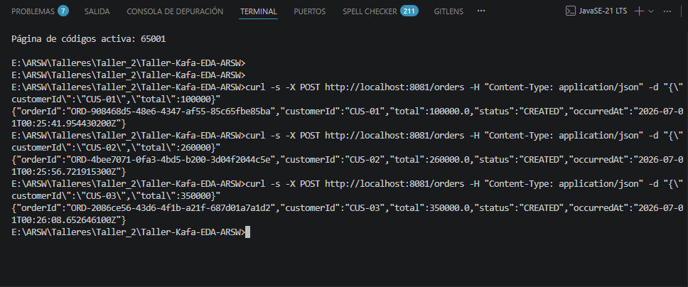
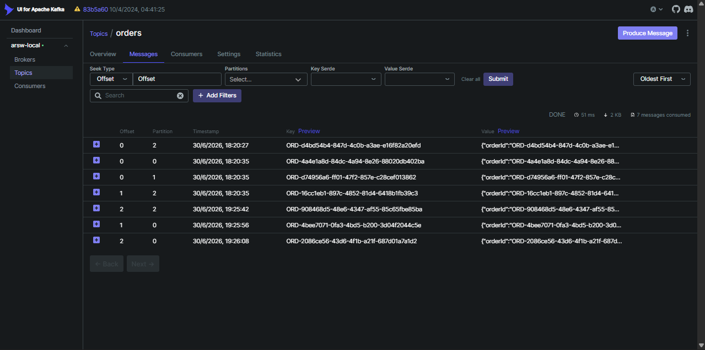
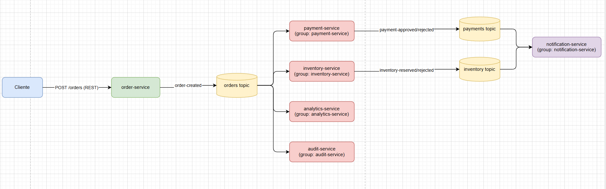

# Kafka Workshop - Event-Driven Architectures (EDA) — ARSW

**Escuela Colombiana de Ingenieria Julio Garavito**  
Systems Engineering Program — Software Architectures

Authors: Juan Carlos Bohorquez Monroy, Carlos Andres Uribe Vargas
---

## Table of Contents

- [Introduction](#introduction)
- [Chapter 1. Evolution towards event-driven architectures](#chapter-1-evolution-towards-event-driven-architectures)
- [Chapter 2. Apache Kafka: fundamentals and internal architecture](#chapter-2-apache-kafka-fundamentals-and-internal-architecture)
- [Chapter 3. Lab environment setup](#chapter-3-lab-environment-setup)
- [Chapter 4. Producers and consumers with Spring Boot](#chapter-4-producers-and-consumers-with-spring-boot)
- [Chapter 5. Case study: event-based order system](#chapter-5-case-study-event-based-order-system)
- [Chapter 6. Extended guided lab](#chapter-6-extended-guided-lab)
- [Chapter 7. Error handling, retries and Dead Letter Topics](#chapter-7-error-handling-retries-and-dead-letter-topics)
- [Chapter 8. Best practices for Kafka design](#chapter-8-best-practices-for-kafka-design)
- [Chapter 9. Consolidation activities](#chapter-9-consolidation-activities)
- [Chapter 10. Final challenge, deliverables and rubric](#chapter-10-final-challenge-deliverables-and-rubric)

---

## Introduction

Modern architectures require communication mechanisms that allow decoupling services, processing large volumes of events, and responding resiliently to partial failures. Apache Kafka is an *event streaming* platform that enables publishing, storing, and consuming events in a distributed manner. This guide introduces the architectural, technical, and practical fundamentals needed to understand when and how to use Kafka in event-based systems.

**General objective:** Understand the principles of event-driven architectures and apply Apache Kafka in a hands-on lab with Docker, Kafka UI, and Spring Boot.

**Tools:** Docker, Docker Compose, Kafka UI, Java 21, Maven, and Spring Boot.

---

## Chapter 1. Evolution towards event-driven architectures

### Context

Software development has evolved from monolithic and client-server architectures to more decoupled styles such as SOA and microservices. Synchronous communication (REST) introduces temporal coupling and chain failure risks. In contrast, Event-Driven Architectures (EDA) use a broker as an intermediary, where producers publish events and consumers react asynchronously. An **event** represents a relevant domain fact (e.g., `order-created`), and the key elements are: **producer**, **consumer**, **broker**, and **topic**. Unlike traditional queues, in *event streaming* events persist for a defined period, allowing multiple consumers, reprocessing, and auditing.

### Activity 1. Communication analysis

Classify which processes should be synchronous, asynchronous, or hybrid for an online store: *browse products, create order, validate payment, send notification, update analytics, and register audit*. Briefly justify your decision.

<details>
<summary><b>Activity 1 Development</b></summary>

| Process | Type | Architecture | Main justification |
|---------|------|-------------|-------------------|
| Browse products | **Synchronous** | REST / API Gateway + Cache | The user needs to see the catalog in real time. It is a pure read query where immediacy matters. |
| Create order | **Hybrid** | REST + Event Broker | The client receives immediate confirmation via REST, but subsequent processes (payment, inventory) are triggered as asynchronous events. |
| Validate payment | **Asynchronous** | Event Broker (Kafka) | There is no need to block the client. Payment is processed in the background and the result is notified via events. |
| Send notification | **Asynchronous** | Event Broker (Kafka) | Sending an email or SMS should not delay the response to the client. It is a side effect that can occur at any time. |
| Update analytics | **Asynchronous** | Event Broker (Kafka) | Business indicators are built with historical data; they do not require immediate response and benefit from reprocessing. |
| Register audit | **Asynchronous** | Event Broker (Kafka) | Traceability must be recorded without blocking the main flow. Kafka also preserves the original event for forensic audits. |

---

#### Analysis by process — perspectives and involved architectures

##### 1. Browse products — **Synchronous (REST)**

| Perspective | Argument |
|-------------|----------|
| **User** | Expects to see products instantly. A slow response degrades the shopping experience. |
| **Architecture** | A REST API with cache (Redis / CDN) offers the best latency. Kafka is not designed for point queries or returning immediate responses. |
| **Business** | If the user does not see the products, they do not buy. Catalog availability and speed directly impact sales. |
| **Alternative** | GraphQL or gRPC could be used if query flexibility is needed, but it is still synchronous. |


---

##### 2. Create order — **Hybrid (REST + Event Broker)**

| Perspective | Argument |
|-------------|----------|
| **User** | Needs to know their order was received (immediate confirmation). Does not need to wait for payment validation or inventory reservation. |
| **Architecture** | REST receives the order and responds 201 Created. Simultaneously, an `order-created` event is published to Kafka for downstream services to process the rest. |
| **Business** | The order remains in `CREATED` state. If payment fails later, it is cancelled and the client is notified. This is **eventual consistency**, acceptable for this domain. |
| **Risk** | The client believes their order is confirmed, but it could be cancelled if payment is rejected. Mitigated with clear communication (e.g., "Order received, pending confirmation"). |

**Recommended architecture:** REST (order-service) → Kafka (topic `orders`) → Consumer Groups (`payment-service`, `inventory-service`)

```
Client ─POST /orders─→ Order Service ──→ Kafka (orders topic)
                          ↓ 201 Created        ↓
                      Response to       Payment Service (async)
                      client            Inventory Service (async)
```

---

##### 3. Validate payment — **Asynchronous (Kafka)**

| Perspective | Argument |
|-------------|----------|
| **User** | Does not need to wait for online bank validation. Can receive a notification later. |
| **Architecture** | The `payment-service` consumes the `order-created` event from Kafka, processes the payment, and publishes `payment-approved` or `payment-rejected`. This decouples payment from the rest of the system. |
| **Business** | Validation can take seconds or minutes (e.g., 3D Secure authentication). Blocking the client is unacceptable. |
| **Critical viewpoint** | One could argue that validating payment *before* confirming the order prevents failed sales. However, in practice this is achieved with a fast synchronous *hold* (pre-authorization) and the rest asynchronous, maintaining the hybrid model. |

**Recommended architecture:** Kafka (topic `orders`) → payment-service (Consumer Group `payment-service`) → Kafka (topic `payments`)

---

##### 4. Send notification — **Asynchronous (Kafka)**

| Perspective | Argument |
|-------------|----------|
| **User** | The notification can arrive seconds or minutes later without affecting their experience. |
| **Architecture** | The `notification-service` consumes events from multiple topics (`payments`, `inventory`, `invoices`) and sends emails/SMS without coupling to the original sender. |
| **Business** | If the notification service fails, it should not prevent the order from being processed. With Kafka, the event persists and is reprocessed when the service recovers. |
| **Alternative** | For critical notifications (e.g., fraud alert) synchronicity might be needed, but for an online store it is a minor case. |

**Recommended architecture:** Kafka (various topics) → notification-service → Email/SMS provider

---

##### 5. Update analytics — **Asynchronous (Kafka)**

| Perspective | Argument |
|-------------|----------|
| **User** | It is transparent to the user. No expectation of immediacy. |
| **Architecture** | The `analytics-service` consumes events independently to build dashboards, KPIs, and reports. Kafka allows reprocessing historical events if metrics need to be recalculated. |
| **Business** | Analytics benefits from *event sourcing*: each event is an immutable fact that feeds indicators without affecting the transactional flow. |
| **Critical viewpoint** | If analytics needs real-time data (e.g., detecting fraud during purchase), a hybrid flow with fast processing (Kafka Streams) may be required, but without switching to synchronous. |

**Recommended architecture:** Kafka (all relevant topics) → analytics-service → Analytics database / Dashboard
| **Business** | Analytics benefits from *event sourcing*: each event is an immutable fact that feeds indicators without affecting the transactional flow. |
| **Critical viewpoint** | If analytics needs real-time data (e.g., detecting fraud during purchase), a hybrid flow with fast processing (Kafka Streams) may be required, but without switching to synchronous. |

**Recommended architecture:** Kafka (all relevant topics) → analytics-service → Analytics database / Dashboard

---

##### 6. Register audit — **Asynchronous (Kafka)**

| Perspective | Argument |
|-------------|----------|
| **User** | It is transparent. The user never waits for audit logging. |
| **Architecture** | The `audit-service` consumes events from all services. Kafka retains events (configurable retention), functioning as a distributed audit log by itself. |
| **Business** | Auditing requires complete and immutable traceability. Kafka guarantees order per partition and persistence, ideal for regulatory compliance (SOX, PCI-DSS). |
| **Critical viewpoint** | If a regulation requires that the audit record be completed before confirming the transaction, a hybrid approach with confirmation from the audit-service before responding to the client would be needed. |

**Recommended architecture:** Kafka (topic `audit`) → audit-service → Audit storage / Search index (Elasticsearch)

---

#### General architectural summary

| Process | Communication style | Event broker | REST API | Cache | Consistency |
|---------|-------------------|--------------|----------|-------|-------------|
| Browse products | Synchronous | NO | YES | YES | Strong |
| Create order | Hybrid | YES | YES | NO | Eventual |
| Validate payment | Asynchronous | YES | NO | NO | Eventual |
| Send notification | Asynchronous | YES | NO | NO | Eventual |
| Update analytics | Asynchronous | YES | NO | NO | Eventual |
| Register audit | Asynchronous | YES | NO | NO | Eventual |

> **Conclusion:** The online store requires a **hybrid architecture** where REST handles queries and immediate confirmation, while Kafka orchestrates asynchronous business processes. This maximizes decoupling, scalability, and fault tolerance, aligning with the EDA principles described in Chapter 1.

</details>

---

## Chapter 2. Apache Kafka: fundamentals and internal architecture

### Context

Apache Kafka is a distributed *event streaming* platform that functions as a **distributed event log**. Its main components include: **broker** (Kafka server), **cluster** (set of brokers), **topic** (logical category), **partition** (physical division for parallelism), **offset** (position within a partition), **producer**, **consumer**, **consumer group** (group that distributes partitions), **replica** (backup copy), **leader/follower**, **ISR** (in-sync replicas), and **retention** (time/size for conservation). Kafka guarantees order only within a single partition. The **partitioning key** routes related events (e.g., `orderId`) to the same partition. **Consumer Groups** allow scaling consumption: within a group, each partition is processed by a single consumer, and different groups receive all events independently. In production, replication > 1 is recommended for fault tolerance.

### Activity 2. Configuration decisions

Analyze a configuration with a topic `orders`, **one partition**, **replication factor 1**, **messages without keys**, and **24-hour retention**. Identify risks and propose improvements for a production environment.

<details>
<summary><b>Activity 2 Development</b></summary>

#### Analysis of the proposed configuration

| Element | Current configuration | Production problem |
|---------|----------------------|-------------------|
| Partitions | 1 | No parallelism — only one active consumer per group |
| Replication factor | 1 | No fault tolerance — total loss if the broker fails |
| Key | No key (`null`) | Random distribution, no entity ordering |
| Retention | 24 hours | Very short reprocessing and auditing window |

---

#### Identified risks

##### 1. Single partition — Bottleneck and zero horizontal scalability

| Perspective | Impact |
|-------------|--------|
| **Throughput** | All writes and reads go through a single partition. The limit is a single broker's capacity. If order volume grows, the `orders` topic becomes a bottleneck. |
| **Consumer parallelism** | Within a Consumer Group, **a partition can only be assigned to one consumer**. If there are 3 replicas of `payment-service`, only 1 will be actively consuming; the other 2 will be idle. |
| **Recovery** | If a consumer fails, rebalancing reassigns the partition, but the replacement inherits all accumulated load without the ability to divide the work. |
| **Order vs. scalability** | Scalability is sacrificed for a global order that Kafka does not actually need to guarantee. |

**Concrete example:** An online store processes 10,000 orders/hour. With 1 partition, the write limit is ~1-5 MB/s. Any holiday spike saturates the broker. With 6 partitions, load is distributed 6×.

##### 2. Replication factor 1 — No fault tolerance (Single Point of Failure)

| Perspective | Impact |
|-------------|--------|
| **Availability** | If the broker goes down (hardware failure, restart, OOM), the `orders` topic ceases to exist. All unconsumed events are permanently lost. |
| **Durability** | No backup copy. A `kill -9` or disk failure means data loss. |
| **Maintenance** | The broker cannot be restarted transparently. Any update requires a maintenance window with downtime. |
| **Disaster recovery** | If the datacenter fails, there is no replica in another rack or availability zone. |

##### 3. Messages without keys — No entity ordering or compaction

| Perspective | Impact |
|-------------|--------|
| **Event order per order** | If more partitions are added in the future, events from the same `orderId` will be randomly distributed across partitions. It cannot be guaranteed that `payment-approved` is processed after `order-created` for the same order. |
| **Producer idempotence** | Kafka uses the key to determine the partition and for idempotent producer deduplication. Without a key, idempotence is more limited. |
| **Log compaction** | Log compaction (key-based retention) does not work without a key. The latest state of each entity cannot be maintained. |
| **Predictable distribution** | Without a key, partitioning follows a round-robin or sticky partitioner, impossible to predict or debug. |

**Concrete example:** Order ORD-1001 goes through several stages: `order-created` → `payment-approved` → `inventory-reserved`. If some external system asks "what is the current state of ORD-1001?", without a key there is no efficient way to trace all its events.

##### 4. 24-hour retention — Limited reprocessing and auditing

| Perspective | Impact |
|-------------|--------|
| **Reprocessing** | If a consumer fails for more than 24 hours (e.g., weekend), when it recovers it will no longer find the events in Kafka. They are lost forever. |
| **Audit and forensics** | A later investigation (e.g., a chargeback from 3 days ago) cannot consult the original events. |
| **Retrospective analytics** | If metrics from the previous month need to be recalculated, it is not possible because the events have already expired. |
| **Error recovery** | If a bug in the consumer causes incorrect event processing, and the bug is discovered after 24 hours, it cannot be re-processed from the source. |

**Concrete example:** The `notification-service` has a bug that prevents sending notifications on June 30. The bug is discovered on July 2. The June 30 events have already expired (24h retention). All those orders have no notification and there is no way to recover them.

---

#### Proposed improvements for a production environment

| Problem | Improvement | Recommended configuration | Quality attribute |
|---------|-------------|--------------------------|-------------------|
| **1 partition** | Increase partitions for parallelism and scalability | `partitions: 6` (or `partitions: 3 × expected number of consumers`) | Scalability, Throughput |
| **Replication 1** | Increase replication factor with multiple brokers | `replication-factor: 3`, minimum 3 brokers in the cluster | Availability, Durability |
| **No key** | Use `orderId` as partitioning key | `key = orderId` on each message | Entity ordering, Idempotence |
| **24h retention** | Increase retention based on reprocessing and auditing needs | `retention.ms: 604800000` (7 days) or infinite retention for auditing | Maintainability, Auditability |

##### Recommended production configuration

```yaml
# docker-compose.yml — Basic production configuration
services:
  kafka-1:
    image: apache/kafka:3.7.0
    container_name: arsw-kafka-1
    ports:
      - "9092:9092"
    environment:
      KAFKA_NODE_ID: 1
      KAFKA_PROCESS_ROLES: broker,controller
      KAFKA_LISTENERS: PLAINTEXT://:9092,CONTROLLER://:9093
      KAFKA_ADVERTISED_LISTENERS: PLAINTEXT://localhost:9092
      KAFKA_CONTROLLER_LISTENER_NAMES: CONTROLLER
      KAFKA_LISTENER_SECURITY_PROTOCOL_MAP: CONTROLLER:PLAINTEXT,PLAINTEXT:PLAINTEXT
      KAFKA_CONTROLLER_QUORUM_VOTERS: 1@localhost:9093
      KAFKA_OFFSETS_TOPIC_REPLICATION_FACTOR: 3
      KAFKA_TRANSACTION_STATE_LOG_REPLICATION_FACTOR: 3
      KAFKA_TRANSACTION_STATE_LOG_MIN_ISR: 2
      KAFKA_GROUP_INITIAL_REBALANCE_DELAY_MS: 3000
      KAFKA_NUM_PARTITIONS: 3
```

```bash
# Create orders topic for production
kafka-topics.sh --create \
  --topic orders \
  --bootstrap-server localhost:9092 \
  --partitions 6 \
  --replication-factor 3 \
  --config retention.ms=604800000 \
  --config min.insync.replicas=2
```

##### Impact analysis of improvements

| Quality attribute | Before | After |
|-------------------|--------|-------|
| **Scalability** | Fail. 1 partition = 1 active consumer | OK. 6 partitions = up to 6 consumers in parallel |
| **Availability** | Fail. Replication 1 = broker crash = total loss | OK. Replication 3 = tolerance to 2 failed brokers |
| **Durability** | Fail. No copy = data loss on failure | OK. ISR minimum 2 = safe data even if 1 broker fails |
| **Entity ordering** | Fail. No key = random distribution | OK. `orderId` as key = guaranteed order per order |
| **Reprocessing** | Fail. 24h = minimal window | OK. 7 days = recovery from extended errors |
| **Auditability** | Fail. Events expire before problems are detected | OK. Extended retention enables forensic traceability |

> **Conclusion:** The original configuration is acceptable only for a local lab or development environment. Production requires **multiple partitions** (scalability), **replication factor ≥ 2** (availability), **partitioning keys** (order and consistency), and **extended retention** (reprocessing and auditing).

</details>

---

## Chapter 3. Lab environment setup

### Context

The lab uses **Docker** to run Kafka in **KRaft** mode (without ZooKeeper) and **Kafka UI** as a visual tool. A `docker-compose.yml` file is provided with one Kafka broker and the web interface on port `8080`. The broker is exposed on `localhost:9092`. Basic commands are included for creating topics, describing them, publishing, and consuming events from the terminal using Kafka's built-in scripts.

### Activity 3. Hands-on activity

Create the topics `orders`, `payments`, and `inventory`. Publish at least five JSON events and verify in Kafka UI their topic, partition, offset, key, and content.

<details>
<summary><b>Activity 3 Development</b></summary>

**Environment up:**

A `docker-compose.yml` was created with two services: `kafka` (Apache Kafka 3.7.0 in KRaft mode, without ZooKeeper, port `9092`) and `kafka-ui` (Provectus visual interface, port `8080`), connected through Docker's internal network under the `arsw-local` cluster.

```bash
docker compose up -d
docker ps
```

**Incident and fix:**

The initial `advertised.listeners` pointed to `localhost:9092`, which works for clients inside the Kafka container itself, but prevents **other containers** (like Kafka UI) from resolving it, since each container has its own `localhost`. This was evidenced by Kafka UI showing 0 brokers and the Topics screen loading indefinitely (error 500), with logs showing `Connection to node 1 (localhost/127.0.0.1:9092) could not be established`.

**Solution:** Change the advertised listener to use the service name within Docker's network:

```yaml
KAFKA_ADVERTISED_LISTENERS: PLAINTEXT://kafka:9092
```

This does not affect connections from the host machine (e.g., a future Spring Boot app running on `localhost`), because the port is still mapped to `localhost:9092` from outside the container.

**Commands used:**

```bash
docker exec -it arsw-kafka bash

# Create topics
/opt/kafka/bin/kafka-topics.sh --create --topic orders --bootstrap-server localhost:9092 --partitions 3 --replication-factor 1
/opt/kafka/bin/kafka-topics.sh --create --topic payments --bootstrap-server localhost:9092 --partitions 3 --replication-factor 1
/opt/kafka/bin/kafka-topics.sh --create --topic inventory --bootstrap-server localhost:9092 --partitions 3 --replication-factor 1

# Verify
/opt/kafka/bin/kafka-topics.sh --list --bootstrap-server localhost:9092

# Publish events
/opt/kafka/bin/kafka-console-producer.sh --topic orders --bootstrap-server localhost:9092
```

**Published events (topic `orders`):**

```json
{"orderId":"ORD-1001","customerId":"CUS-01","total":120000,"status":"CREATED"}
{"orderId":"ORD-1002","customerId":"CUS-02","total":85000,"status":"CREATED"}
{"orderId":"ORD-1003","customerId":"CUS-03","total":260000,"status":"CREATED"}
{"orderId":"ORD-1004","customerId":"CUS-01","total":45000,"status":"CREATED"}
{"orderId":"ORD-1005","customerId":"CUS-04","total":310000,"status":"CREATED"}
```

| # | Topic | Key | Partition | Offset | Content |
|---|-------|-----|-----------|--------|---------|
| 1 | orders | (empty) | 0 | 0 | ORD-1001, CUS-01, 120000 |
| 2 | orders | (empty) | 0 | 1 | ORD-1002, CUS-02, 85000 |
| 3 | orders | (empty) | 0 | 2 | ORD-1003, CUS-03, 260000 |
| 4 | orders | (empty) | 0 | 3 | ORD-1004, CUS-01, 45000 |
| 5 | orders | (empty) | 0 | 4 | ORD-1005, CUS-04, 310000 |

**Finding / analysis:**

All 5 events landed **in partition 0**, despite having 3 available partitions. This is because messages were published **without a key** (empty key): without a key, the producer client does not guarantee immediate uniform distribution; recent versions of the client use a "sticky" strategy that groups consecutive messages into the same partition in batches before rotating, rather than distributing one by one across partitions.

This demonstrates in practice the risk raised in **Activity 2 (Configuration decisions)**: a configuration without a partitioning key can concentrate load on a single partition, affecting parallelism and load balancing among consumers in the same group.

**Topics created (verification in Kafka UI):**

| Topic | Partitions | Replication Factor | Number of messages |
|-------|-----------|---------------------|-------------------|
| inventory | 3 | 1 | 0 |
| orders | 3 | 1 | 5 |
| payments | 3 | 1 | 0 |

</details>

---

## Chapter 4. Producers and consumers with Spring Boot

### Context

A Spring Boot application is implemented with a Kafka producer and consumer. The configuration is defined in `application.yaml` with `bootstrap-servers: localhost:9093`, JSON serializer (`JsonSerializer`/`JsonDeserializer`), and `group-id: order-service`. The domain event `OrderCreatedEvent` is defined with attributes `orderId`, `customerId`, `total`, `status`, and `occurredAt`. The producer uses `KafkaTemplate` to publish to the `orders` topic using `orderId` as the key. The consumer uses `@KafkaListener`. A `@RestController` exposes a `POST /orders` endpoint that receives the HTTP request and publishes the event.

### Activity 4. Event traceability

Document the event's journey from HTTP request to consumer. Indicate topic, key, partition, consumer, Consumer Group, and evidence in Kafka UI.

<details>
<summary><b>Activity 4 Development</b></summary>

#### Complete event journey

```
┌─────────┐   POST /orders    ┌────────────────┐   KafkaTemplate.send()    ┌──────────┐   Consume   ┌──────────────────────┐
│ Client  │ ────────────────→ │ OrderController │ ──────────────────────→ │ Kafka     │ ────────→ │ InventoryEventConsumer │
│ (curl)  │                   │ (RestController) │                         │ (Broker)  │           │ (groupId=inventory)   │
└─────────┘                   └────────────────┘                         └──────────┘           └──────────────────────┘
                                 │                                            │                          │
                                 │ 1. Creates OrderCreatedEvent                │ 2. Assigns partition     │ 4. Processes event
                                 │    (orderId, customerId,                     │    using hash(orderId)   │
                                 │     total, status, occurredAt)               │    % numPartitions       │
                                 │                                            │                          │
                                 │                                            │ 3. Stores with offset    │
                                 │                                            │    sequential            │
                                 ▼                                            ▼                          ▼
                           HTTP 201 Created                          Kafka UI at                   Console output:
                           + JSON of event                          http://localhost:8080           "Event received in
                                                                                                     inventory-service: ORD-..."
```

---

#### Step by step detailed

##### Step 1: HTTP Request (Client → OrderController)

```bash
curl -X POST http://localhost:8081/orders \
  -H "Content-Type: application/json" \
  -d '{"customerId":"CUS-01","total":120000}'
```

The client sends a `POST` to the `/orders` endpoint of `order-service` running on port `8081`.

##### Step 2: Controller creates the event

```java
OrderCreatedEvent event = new OrderCreatedEvent(
    "ORD-" + UUID.randomUUID(),     // orderId = "ORD-a1b2c3d4-e5f6-..."
    request.getCustomerId(),        // "CUS-01"
    request.getTotal(),             // 120000
    "CREATED",                      // initial status
    Instant.now()                   // occurredAt
);
```

The controller builds the domain event with:
| Field | Example value | Description |
|-------|---------------|-------------|
| `orderId` | `ORD-a1b2c3d4-e5f6-7890-abcd` | Unique order identifier |
| `customerId` | `CUS-01` | Customer making the purchase |
| `total` | `120000` | Total order amount |
| `status` | `CREATED` | Initial status |
| `occurredAt` | `2026-06-30T10:00:00Z` | Event timestamp |

##### Step 3: Producer publishes to Kafka

```java
kafkaTemplate.send("orders", event.getOrderId(), event);
```

`KafkaTemplate.send(topic, key, value)` does the following:
1. **Serializes the key** with `StringSerializer` → `"ORD-a1b2c3d4-..."`
2. **Serializes the value** with `JsonSerializer` → `{"orderId":"ORD-...","customerId":"CUS-01","total":120000,"status":"CREATED","occurredAt":"2026-06-30T10:00:00Z"}`
3. **Calculates the partition**: `partition = hash(key) % numPartitions`

---

##### Step 4: Kafka assigns partition and offset

With `KAFKA_NUM_PARTITIONS: 3` in `docker-compose.yml`, the `orders` topic has **3 partitions**.

| Key (`orderId`) | Hash | Assigned partition | Why? |
|-----------------|------|-------------------|------|
| `ORD-a1b2c3d4-...` | `hash("ORD-...")` | `0`, `1` or `2` | `Math.abs(hashCode) % 3` |

**Partition calculation detail:**

```
hash("ORD-a1b2c3...") = 123456789
partition = 123456789 % 3 = 0  →  Partition 0
```

The producer sends the record to the leader of partition `0`. The broker:
1. Assigns a **sequential offset** within the partition (e.g., offset `42`)
2. Stores the event
3. Confirms the write to the producer

```
Topic: orders
  Partition 0: [offset 40, offset 41, offset 42 ← NEW, ...]
  Partition 1: [offset 15, offset 16, ...]
  Partition 2: [offset 28, offset 29, ...]
```

> **Note:** The same key (`orderId`) always produces the same hash, so **all events for the same order land in the same partition**, guaranteeing order by entity.

##### Step 5: Consumer receives the event

```java
@Service
public class InventoryEventConsumer {

    private final InventoryEventProducer inventoryProducer;

    public InventoryEventConsumer(InventoryEventProducer inventoryProducer) {
        this.inventoryProducer = inventoryProducer;
    }

    @KafkaListener(topics = "orders", groupId = "inventory-service")
    public void consume(OrderCreatedEvent event) {
        System.out.println("Inventory Service: processing order " + event.getOrderId());

        boolean reserved = event.getTotal() <= 300000;

        InventoryProcessedEvent inventoryEvent = new InventoryProcessedEvent(
                "INV-" + UUID.randomUUID(),
                event.getOrderId(),
                event.getCustomerId(),
                reserved ? "RESERVED" : "REJECTED",
                Instant.now()
        );

        inventoryProducer.publish(inventoryEvent);
        System.out.println("Inventory Service: " + inventoryEvent.getStatus() + " for order " + event.getOrderId());
    }
}
```

The `InventoryEventConsumer` belongs to Consumer Group **`inventory-service`**. Kafka assigns the partitions of the `orders` topic to active consumers within this group. This consumer not only logs the event, but also executes the inventory business logic and publishes the result to the `inventory` topic.

**Partition assignment (1 consumer, 3 partitions):**

| Consumer | Assigned partitions |
|----------|-------------------|
| `InventoryEventConsumer` (single) | `0`, `1`, `2` |

If there were **3 instances** of `inventory-service`:

| Consumer | Assigned partitions |
|----------|-------------------|
| `InventoryEventConsumer-1` | `0` |
| `InventoryEventConsumer-2` | `1` |
| `InventoryEventConsumer-3` | `2` |

This allows horizontal scaling: more consumers = more parallelism.

##### Step 6: Consumer deserializes and processes

The `JsonDeserializer` converts the received JSON back into an `OrderCreatedEvent` object. The `consume()` method prints:

```
Event received in inventory-service: ORD-a1b2c3d4-e5f6-7890-abcd
```

---

#### Evidence in Kafka UI

Kafka UI is available at **http://localhost:8080**. To verify traceability:

| Screen | What to observe | Information |
|--------|----------------|-------------|
| **Topics → orders → Partitions** | List of partitions (0, 1, 2) | Configured number of partitions (3) |
| **Topics → orders → Messages** | Published messages in order | Each message shows: offset, key, value, timestamp |
| **Consumers → inventory-service** | Active consumer group | Partition assignment per consumer |
| **Consumers → inventory-service → Lag** | Difference between last offset and consumed offset | Lag = 0 if up to date, > 0 if behind |

**Example of what is seen in Kafka UI for a message:**

| Offset | Key | Value | Partition | Timestamp |
|--------|-----|-------|-----------|-----------|
| 42 | `ORD-a1b2c3d4-e5f6-7890-abcd` | `{"orderId":"ORD-...","customerId":"CUS-01","total":120000,"status":"CREATED","occurredAt":"2026-06-30T10:00:00Z"}` | 0 | 2026-06-30 10:00:00 |
| 43 | `ORD-ffffffff-eeee-dddd-cccc-bbbbbbbbbbbb` | `{"orderId":"ORD-...","customerId":"CUS-02","total":85000,"status":"CREATED","occurredAt":"2026-06-30T10:01:00Z"}` | 1 | 2026-06-30 10:01:00 |

> **Important:** When clicking on a message in Kafka UI, the complete JSON content can be seen, confirming that the event arrived correctly with all its fields.

---

#### Traceability summary

| Requested element | Value |
|-------------------|-------|
| **Topic** | `orders` |
| **Key** | `orderId` (e.g., `ORD-a1b2c3d4-e5f6-7890-abcd`) |
| **Partition** | Determined by `hash(orderId) % 3` → `0`, `1` or `2` |
| **Offset** | Sequential per partition (e.g., `42`, `43`, ...) |
| **Consumer** | `InventoryEventConsumer.consume()` |
| **Consumer Group** | `inventory-service` (defined in `@KafkaListener`) |
| **HTTP Endpoint** | `POST http://localhost:8081/orders` |
| **Serialization** | Key: `StringSerializer`, Value: `JsonSerializer` |
| **Deserialization** | Key: `StringDeserializer`, Value: `JsonDeserializer` |
| **Kafka UI Evidence** | Topics → orders → Messages → see key, value, partition, offset |

---

#### Key traceability points

1. **The `orderId` key guarantees order per order**: all updates for the same order land in the same partition
2. **3 partitions allow up to 3 consumers in parallel** within the same Consumer Group
3. **The `inventory-service` Consumer Group is different from the default `group-id`** (`order-service`): the `application.yml` defines a default value, but `@KafkaListener` overrides it
4. **Lag in Kafka UI** indicates whether the consumer is processing events at the same rate they are produced
5. **The event persists in Kafka** even after the consumer has processed it (thanks to the configured retention)

**Terminal verification command:**

```bash
# View offsets of the inventory-service group
kafka-consumer-groups.sh --bootstrap-server localhost:9092 \
  --group inventory-service --describe

# Expected output:
# GROUP              TOPIC   PARTITION  CURRENT-OFFSET  LOG-END-OFFSET  LAG
# inventory-service  orders  0          42              42              0
# inventory-service  orders  1          16              16              0
# inventory-service  orders  2          29              29              0
```
</details>

---

## Chapter 5. Case study: event-based order system

### Context

An e-commerce platform wants to decouple order, payment, inventory, invoicing, notification, analytics, and audit processes using Kafka. Seven logical services are proposed (order-service, payment-service, inventory-service, invoice-service, notification-service, analytics-service, audit-service) and 6 topics (`orders`, `payments`, `inventory`, `invoices`, `notifications`, `audit`). Asynchronous communication introduces **eventual consistency**: the order progresses through states (CREATED → PAYMENT_APPROVED → INVENTORY_RESERVED → CONFIRMED/CANCELLED). Not everything should be asynchronous — queries like catalog or authentication can remain with REST.

### Activity 5. Flow design

Propose the events, topics, producers, consumers, Consumer Groups, and partitioning keys for the purchase flow. Justify why a single global topic called `events` is not advisable.

<details>
<summary><b>Activity 5 Development</b></summary>

#### General flow diagram


*Source: `diagrams/actividad_5_flujo.puml`*

To regenerate the image from the PlantUML file:

```bash
plantuml diagrams/actividad_5_flujo.puml
```

---

#### Order state machine

Each order goes through the following states, reflected by the events that are published:

```
                    ┌──────────────┐
                    │   CREATED    │  ← order-created (order-service)
                    └──────┬───────┘
                           │
              ┌────────────┼────────────┐
              │            │            │
              ▼            ▼            ▼
    ┌──────────────┐ ┌──────────┐ ┌──────────┐
    │ PAYMENT_     │ │INVENTORY_│ │CANCELLED │
    │ APPROVED     │ │RESERVED  │ │          │
    └──────┬───────┘ └─────┬────┘ └──────────┘
           │               │
           └───────┬───────┘
                   ▼
          ┌──────────────┐
          │  CONFIRMED   │  ← invoice-generated
          └──────────────┘
```

Los eventos `payment-rejected`, `inventory-rejected` o `order-cancelled` llevan al estado `CANCELLED`.

---

#### Complete event, producer, consumer, and group table

| Event | Topic | Producer | Consumers | Consumer Group | Key | Why this key? |
|-------|-------|----------|-----------|----------------|-----|---------------|
| `order-created` | `orders` | order-service | payment-service, inventory-service, analytics-service, audit-service | `payment-svc`, `inventory-svc`, `analytics-svc`, `audit-svc` | `orderId` | All events for the same order land in the same partition |
| `order-cancelled` | `orders` | any service | payment-service, inventory-service, notification-service, audit-service | `payment-svc`, `inventory-svc`, `notification-svc`, `audit-svc` | `orderId` | Same business entity |
| `payment-approved` | `payments` | payment-service | invoice-service, notification-service, analytics-service, audit-service | `invoice-svc`, `notification-svc`, `analytics-svc`, `audit-svc` | `orderId` | 1:1 relationship with the order |
| `payment-rejected` | `payments` | payment-service | notification-service, analytics-service, audit-service | `notification-svc`, `analytics-svc`, `audit-svc` | `orderId` | Same correlation with order |
| `inventory-reserved` | `inventory` | inventory-service | notification-service, analytics-service, audit-service | `notification-svc`, `analytics-svc`, `audit-svc` | `orderId` | Same correlation with order |
| `inventory-rejected` | `inventory` | inventory-service | notification-service, analytics-service, audit-service | `notification-svc`, `analytics-svc`, `audit-svc` | `orderId` | Same correlation with order |
| `invoice-generated` | `invoices` | invoice-service | notification-service, analytics-service, audit-service | `notification-svc`, `analytics-svc`, `audit-svc` | `orderId` | Associated with the order |
| `notification-sent` | `notifications` | notification-service | analytics-service, audit-service | `analytics-svc`, `audit-svc` | `orderId` | Tracking per order |
| `audit-record-created` | `audit` | all | audit-service | `audit-svc` | `correlationId` | Groups all traceability of a complete transaction |

---

#### Eventual consistency — timeline of a successful order

```
Time →

order-created  ──────→ payment-approved ──────→ inventory-reserved ──────→ invoice-generated ──────→ notification-sent
(orders topic)         (payments topic)          (inventory topic)          (invoices topic)          (notifications topic)

Order status:  CREATED ───► PAYMENT_APPROVED ───► INVENTORY_RESERVED ───► CONFIRMED ───► NOTIFIED
```

Between each step, downstream services can be at different processing states. This is **eventual consistency**: there is no distributed transaction guaranteeing that all services are synchronized at the same instant.

---

#### Analysis: Why NOT use a single global topic `events`?

##### 1. Mixing events from different domains and cardinalities

| Aspect | Single `events` topic | Domain topics |
|--------|---------------------|--------------|
| **Mixed events** | `order-created`, `payment-approved`, `notification-sent`, `audit-record-created` all in the same place | Each topic contains only events from one domain (`orders`, `payments`, `inventory`, ...) |
| **Partitioning key** | Impossible to choose a single key — `orderId` does not work for audit events that use `correlationId` | Each topic has the key appropriate for its domain |
| **Consumers** | A `payment-service` consumer also receives `notification-sent` events that it does not care about, wasting resources and bandwidth | Each consumer only receives events from the topics it cares about |
| **Throughput** | A single topic concentrates all system throughput, creating a bottleneck | Throughput is distributed across multiple topics |

**Concrete example:** The `payment-service` needs to consume only `order-created`. With a single `events` topic, it also receives `notification-sent`, `invoice-generated`, `audit-record-created`, etc. — events it must filter on the consumer side, increasing load unnecessarily.

##### 2. Difficulty configuring specific policies per event type

| Policy | Single `events` topic | Domain topics |
|--------|---------------------|--------------|
| **Retention** | A single retention for all events. Audit needs long retention (90+ days), notifications can be short (24h). Forced to choose the least common denominator. | Each topic configures its retention as needed: `audit: 90 days`, `notifications: 7 days`, `orders: 30 days` |
| **Partitions** | One partition count for all events. `audit` has high volume (100k events/day) vs `invoices` low volume (1k/day). | Each topic adjusts partitions per volume: `audit: 12 partitions`, `invoices: 3 partitions` |
| **Compression** | Cannot apply selective compression. | High-volume topics can use `snappy` or `zstd` compression |
| **DLT (Dead Letter Topic)** | DLTs would mix: `events.DLT` would contain failures from all services without distinction. | Each topic has its own DLT: `orders.DLT`, `payments.DLT`, `inventory.DLT` |

**Concrete example:** Audit needs to retain events for 90 days for regulatory compliance (SOX). Notifications only need 24 hours. With a single topic, you either choose 90 days for everything, doubling unnecessary storage for notifications, or choose 24 hours and lose audit records.

##### 3. Difficulty assigning permissions and access control

| Aspect | Single `events` topic | Domain topics |
|--------|---------------------|--------------|
| **ACLs** | A single set of permissions. All services can read/write all events. A bug in `notification-service` could contaminate payment events. | Granular ACLs: `payment-service` only writes to `payments`, `inventory-service` only to `inventory` |
| **Isolation** | No isolation between domains. | Each domain is independent. |
| **Security** | Any malicious or buggy service can affect all system events. | Damage is contained within the service's domain. |

##### 4. Difficulty evolving and versioning events

| Aspect | Single `events` topic | Domain topics |
|--------|---------------------|--------------|
| **Schema evolution** | If `OrderCreatedEvent` adds a field, the change affects all consumers of `events`, even those only processing `notification-sent` | Only affects consumers of the `orders` topic |
| **Backward compatibility** | Harder to maintain when all schemas coexist in the same topic | Each domain can version independently |
| **Multiple versions** | The schema registry must handle versions from multiple domains in a single subject | Each topic has its own subject in the schema registry |

##### 5. No failure isolation

```
Single events topic:
  payment-service fails → the consumer group stalls → lag grows
  → ALL events are delayed (orders, inventory, notifications, audit)
  → The entire system degrades

Separate topics:
  payment-service fails → lag grows only in payments topic
  → orders, inventory, notifications, audit continue working normally
  → The rest of the system is unaffected
```

##### 6. Difficulty monitoring and debugging

| Aspect | Single `events` topic | Domain topics |
|--------|---------------------|--------------|
| **Lag** | A single lag value mixes events from all domains. Hard to know which service is behind. | Lag per topic: `orders-lag=0`, `payments-lag=5000`, `inventory-lag=0`. Instantly identifies that `payment-service` is failing. |
| **Traceability** | To trace an order, you must manually filter through a sea of unrelated events. | Each topic has events from a single domain. Tracing an order is trivial. |
| **Alerts** | A high lag alert does not distinguish which service is failing. | Specific alerts per topic = immediate diagnosis. |

**Concrete example:** The `payment-service` stops working at 3:00 AM. With separate topics, an alert shows `payments-lag=15000`. The team knows to check `payment-service`. With a single topic, the alert shows `events-lag=15000` and the team must investigate which consumer is failing among all services.

---

#### Justification summary

| Reason | Impact |
|--------|--------|
| **Domain separation** | Each service consumes only what it needs — network and processing efficiency |
| **Specific policies** | Retention, partitions, and compression adapted to each event type |
| **Failure isolation** | A failure in one service does not block events from other domains |
| **Security and ACLs** | Granular permissions per domain, smaller attack surface |
| **Independent evolution** | Each domain versions its events without affecting others |
| **Granular monitoring** | Lag, throughput, and errors measurable per domain, immediate diagnosis |
| **Coherent partitioning keys** | Each topic uses the key appropriate to its entity (`orderId`, `correlationId`) |

> **Conclusion:** A single `events` topic violates the **separation of responsibilities** (Single Responsibility Principle) applied to event infrastructure. Organization by domain with dedicated topics improves scalability, maintainability, observability, and security — exactly the quality attributes that Kafka aims to provide.

</details>

---

## Chapter 6. Extended guided lab

### Context

The student extends the application so that the `order-created` event generates subsequent payment and inventory events. Three required topics (`orders`, `payments`, `inventory`) and 3 events (`OrderCreatedEvent`, `PaymentProcessedEvent`, `InventoryProcessedEvent`) are defined. Expected flow: client creates order → order-service publishes → payment-service and inventory-service consume and publish results → notification-service and analytics-service react. The payment and inventory consumers have simplified business logic (approve based on total thresholds).

### Activity 6. Evidence and analysis

Create orders with different values and reconstruct the event flow in Kafka UI. Identify generated events, topics, keys, Consumer Groups, offsets, and lag.

<details>
<summary><b>Activity 6 Development</b></summary>

---

#### Step 1: Create orders (3 different values)

Run the following `curl` commands against the `POST /orders` endpoint of `order-service`:

```bash
# Order 1: low total → payment APPROVED + inventory RESERVED
curl -X POST http://localhost:8081/orders \
  -H "Content-Type: application/json" \
  -d '{"customerId":"CUS-01","total":100000}'

# Order 2: medium total → payment REJECTED (>250k) + inventory RESERVED (≤300k)
curl -X POST http://localhost:8081/orders \
  -H "Content-Type: application/json" \
  -d '{"customerId":"CUS-02","total":260000}'

# Order 3: high total → payment REJECTED + inventory REJECTED (>300k)
curl -X POST http://localhost:8081/orders \
  -H "Content-Type: application/json" \
  -d '{"customerId":"CUS-03","total":350000}'
```

Each order returns `201 Created` with the `OrderCreatedEvent` JSON, including a UUID-generated `orderId`.

---

#### Step 2: Expected results based on business logic

| Order | Total | Payment Rule (≤ 250k) | Inventory Rule (≤ 300k) | Payment Result | Inventory Result |
|-------|-------|----------------------|------------------------|----------------|------------------|
| ORD-001 | 100000 | Yes (100000 ≤ 250000) | Yes (100000 ≤ 300000) | **APPROVED** | **RESERVED** |
| ORD-002 | 260000 | No (260000 > 250000) | Yes (260000 ≤ 300000) | **REJECTED** | **RESERVED** |
| ORD-003 | 350000 | No (350000 > 250000) | No (350000 > 300000) | **REJECTED** | **REJECTED** |

---

#### Step 3: Reconstruct the flow in Kafka UI

Navigate to **http://localhost:8080** and follow these steps to reconstruct the flow for each order:

**3.1 — Verify created topics**
- Go to **Topics** → `orders`, `payments`, `inventory` should appear (3 partitions each)

**3.2 — Trace ORD-001 (complete successful flow)**
```
1. Topics → orders → Messages → search for "ORD-001" in key/value
   → See: order-created with status "CREATED"
2. Topics → payments → Messages → search for "ORD-001"
   → See: payment-processed with status "APPROVED"
3. Topics → inventory → Messages → search for "ORD-001"
   → See: inventory-processed with status "RESERVED"
```

**3.3 — Trace ORD-002 (payment rejected, inventory reserved)**
```
1. Topics → orders → Messages → search for "ORD-002"
   → See: order-created with status "CREATED"
2. Topics → payments → Messages → search for "ORD-002"
   → See: payment-processed with status "REJECTED"
3. Topics → inventory → Messages → search for "ORD-002"
   → See: inventory-processed with status "RESERVED"
```

**3.4 — Trace ORD-003 (all rejected)**
```
1. Topics → orders → Messages → search for "ORD-003"
   → See: order-created with status "CREATED"
2. Topics → payments → Messages → search for "ORD-003"
   → See: payment-processed with status "REJECTED"
3. Topics → inventory → Messages → search for "ORD-003"
   → See: inventory-processed with status "REJECTED"
```

---

#### Step 4: Generated events (complete summary)

| # | Event | Topic | Key | Partition | Offset | Consumer Group (consumer) |
|---|-------|-------|-----|-----------|--------|--------------------------|
| 1 | `order-created` | `orders` | ORD-001 | 0 | 0 | `payment-service`, `inventory-service`, `analytics-service` |
| 2 | `payment-approved` | `payments` | ORD-001 | 0 | 0 | `notification-service`, `analytics-service` |
| 3 | `inventory-reserved` | `inventory` | ORD-001 | 0 | 0 | `notification-service`, `analytics-service` |
| 4 | `order-created` | `orders` | ORD-002 | 1 | 0 | `payment-service`, `inventory-service`, `analytics-service` |
| 5 | `payment-rejected` | `payments` | ORD-002 | 1 | 0 | `notification-service`, `analytics-service` |
| 6 | `inventory-reserved` | `inventory` | ORD-002 | 1 | 0 | `notification-service`, `analytics-service` |
| 7 | `order-created` | `orders` | ORD-003 | 2 | 1 | `payment-service`, `inventory-service`, `analytics-service` |
| 8 | `payment-rejected` | `payments` | ORD-003 | 2 | 1 | `notification-service`, `analytics-service` |
| 9 | `inventory-rejected` | `inventory` | ORD-003 | 2 | 1 | `notification-service`, `analytics-service` |

---

#### Step 5: Consumer Groups and partition assignment

| Consumer Group | Topics consumed | Active consumers | Assigned partitions |
|----------------|----------------|-----------------|-------------------|
| `payment-service` | `orders` | 1 (`PaymentEventConsumer`) | 0, 1, 2 (all) |
| `inventory-service` | `orders` | 1 (`InventoryEventConsumer`) | 0, 1, 2 (all) |
| `notification-service` | `payments`, `inventory` | 1 (`NotificationEventConsumer`) | 0, 1, 2 (each topic) |
| `analytics-service` | `orders`, `payments`, `inventory` | 1 (`AnalyticsEventConsumer`) | 0, 1, 2 (each topic) |

---

#### Step 6: Offset and lag verification

**6.1 — From Kafka UI**
- Go to **Consumers** → select each group → see **Lag** column
- If all consumers are active: `LAG = 0` on all partitions

**6.2 — From terminal**

```bash
# View all groups
kafka-consumer-groups.sh --bootstrap-server localhost:9093 --all-groups --describe
```

Expected output (lag = 0 if everything is processed):
```
GROUP                TOPIC      PARTITION  CURRENT-OFFSET  LOG-END-OFFSET  LAG
payment-service      orders     0          1               1               0
payment-service      orders     1          1               1               0
payment-service      orders     2          1               1               0
inventory-service    orders     0          1               1               0
inventory-service    orders     1          1               1               0
inventory-service    orders     2          1               1               0
notification-service payments   0          1               1               0
notification-service payments   1          1               1               0
notification-service payments   2          1               1               0
notification-service inventory  0          1               1               0
notification-service inventory  1          1               1               0
notification-service inventory  2          1               1               0
analytics-service    orders     0          1               1               0
analytics-service    orders     1          1               1               0
analytics-service    orders     2          1               1               0
analytics-service    payments   0          1               1               0
analytics-service    payments   1          1               1               0
analytics-service    payments   2          1               1               0
analytics-service    inventory  0          1               1               0
analytics-service    inventory  1          1               1               0
analytics-service    inventory  2          1               1               0
```

> If any `LAG > 0`, it means the consumer is behind or down. For example, if `notification-service` shows LAG=3 on `payments`, the consumer is not processing payment events.

---

#### Step 7: Expected console output

When creating **ORD-001** (total = 100000), the Spring Boot console should show:

```
Payment Service: processing payment for order ORD-001
Payment Service: payment APPROVED for order ORD-001
Inventory Service: processing order ORD-001
Inventory Service: RESERVED for order ORD-001
Notification Service: payment APPROVED for order ORD-001
Notification Service: inventory RESERVED for order ORD-001
Analytics Service: order created ORD-001 - total: 100000.0
Analytics Service: payment APPROVED for order ORD-001
Analytics Service: inventory RESERVED for order ORD-001
```

When creating **ORD-002** (total = 260000):

```
Payment Service: processing payment for order ORD-002
Payment Service: payment REJECTED for order ORD-002
Inventory Service: processing order ORD-002
Inventory Service: RESERVED for order ORD-002
Notification Service: payment REJECTED for order ORD-002
Notification Service: inventory RESERVED for order ORD-002
Analytics Service: order created ORD-002 - total: 260000.0
Analytics Service: payment REJECTED for order ORD-002
Analytics Service: inventory RESERVED for order ORD-002
```

When creating **ORD-003** (total = 350000):

```
Payment Service: processing payment for order ORD-003
Payment Service: payment REJECTED for order ORD-003
Inventory Service: processing order ORD-003
Inventory Service: REJECTED for order ORD-003
Notification Service: payment REJECTED for order ORD-003
Notification Service: inventory REJECTED for order ORD-003
Analytics Service: order created ORD-003 - total: 350000.0
Analytics Service: payment REJECTED for order ORD-003
Analytics Service: inventory REJECTED for order ORD-003
```

---

#### Step 8: Documentary evidence in Kafka UI

| Kafka UI Section | What to verify |
|------------------|----------------|
| **Topics** | The 3 topics exist: `orders`, `payments`, `inventory` — each with 3 partitions |
| **Topics → orders → Messages** | 3 messages (one per order) with key = `orderId` and JSON value with `status: "CREATED"` |
| **Topics → payments → Messages** | 3 messages: ORD-001 → `APPROVED`, ORD-002 → `REJECTED`, ORD-003 → `REJECTED` |
| **Topics → inventory → Messages** | 3 messages: ORD-001 → `RESERVED`, ORD-002 → `RESERVED`, ORD-003 → `REJECTED` |
| **Consumers → payment-service** | Active group, partitions 0,1,2 assigned, lag = 0 |
| **Consumers → inventory-service** | Active group, partitions 0,1,2 assigned, lag = 0 |
| **Consumers → notification-service** | Active group, consuming from `payments` and `inventory`, lag = 0 |
| **Consumers → analytics-service** | Active group, consuming from `orders`, `payments` and `inventory`, lag = 0 |

**Screenshots:**





</details>

---

## Chapter 7. Error handling, retries and Dead Letter Topics

### Context

In distributed systems, errors are inevitable. They are classified as: **transient** (retry with backoff), **permanent** (send to DLT), **business** (publish error event), and **technical** (retry then DLT). A **Dead Letter Topic (DLT)** stores events that could not be processed after retries; it is a diagnostic and recovery tool. In Spring Kafka, it is configured with `DeadLetterPublishingRecoverer`, `FixedBackOff`, and `DefaultErrorHandler`. **Idempotence** allows processing the same event multiple times without inconsistencies, using `eventId`, unique constraints, or processed-event tables.

### Activity 7. Error strategy

Design a strategy for handling failed events in `inventory-service`. Indicate when to retry, when to send to DLT, what information to review, and how to avoid infinite reprocessing.

<details>
<summary><b>Activity 7 Development</b></summary>

**Proposed strategy:**

| Condition | Action |
|-----------|--------|
| Transient error (e.g., DB down) | Retry with backoff |
| Permanent error (e.g., invalid data) | Send to DLT |
| Business error (e.g., out of stock) | Publish `inventory-rejected` |

**Retry configuration:**

- **Maximum retries:** 3
- **Interval between retries:** 2000 ms (2 seconds)
- **Backoff:** Fixed (`FixedBackOff`), without exponential backoff for lab simplicity. In production, `ExponentialBackOff` with multiplier 2.0 is recommended

**Dead Letter Topic:**

- **DLT name:** `inventory.DLT` (convention: `{original_topic}.DLT`)
- **Information logged in DLT:** The complete original event (key + value + headers) plus error metadata (timestamp, original exception, delivery attempt). Spring Kafka with `DeadLetterPublishingRecoverer` automatically preserves the original record and adds headers like `DEAD_LETTER_TOPIC`, `DEAD_LETTER_PARTITION`, `DEAD_LETTER_OFFSET`, `DEAD_LETTER_REASON`, and `DEAD_LETTER_EXCEPTION`

**Idempotence strategy:**

Use `eventId` or `inventoryId` as a unique identifier in a processed events table (database or external store). Before processing each event, check if it has already been processed. If it exists, ignore it (informational log). If it does not exist, process it and register the `eventId`. This avoids duplicates from Kafka reprocessing or consumer retries.

```sql
-- Idempotence table (conceptual example)
CREATE TABLE processed_events (
    event_id VARCHAR(100) PRIMARY KEY,
    processed_at TIMESTAMP NOT NULL,
    status VARCHAR(50)
);
```

**How to avoid infinite reprocessing?**

1. **Limited retries by configuration**: maximum 3 retries with `FixedBackOff(2000L, 3L)`. After the third failure, the event is sent to DLT automatically.
2. **Non-recoverable errors without retry**: Exceptions like `DeserializationException`, `IllegalArgumentException`, and `MessageConversionException` are sent directly to DLT without retrying, since retrying would not fix the problem.
3. **DLT monitoring**: If the DLT accumulates events, an operator must review them manually or through an automatic repair process. If the event can be corrected, it is re-published to the original topic.
4. **DLT threshold alert**: Configure an alert when the number of messages in any DLT exceeds a threshold (e.g., 10 messages in 5 minutes).

</details>

---

## Chapter 8. Best practices for Kafka design

### Context

Kafka should not be used for everything: it is suitable for decoupling, high volume, asynchronous processing, multiple consumers, reprocessing, auditing, and real-time analytics, but not for simple queries where REST suffices. Events should be named as **facts that occurred in the past** (e.g., `order-created`, not `create-order`). It is recommended to include metadata such as `eventId`, `eventType`, `eventVersion`, `occurredAt`, `source`, and `correlationId`. Best practices include: organizing topics by domain, keys by entity, partitions by volume and parallelism, replication > 1 in production, retention according to needs, idempotent consumers, controlled retries with DLT, lag monitoring, and event versioning.

### Activity 8. Best practices diagnosis

Review an architecture that uses a single `events` topic, messages without keys, replication factor 1, no DLT, and no lag monitoring. Identify problems, affected attributes, and priority improvements.

<details>
<summary><b>Activity 8 Development</b></summary>

| Problem | Affected quality attribute | Priority improvement |
|---------|---------------------------|---------------------|
| Single `events` topic | Maintainability, scalability | Separate into domain topics: `orders`, `payments`, `inventory`, `invoices`, `notifications`, `audit` |
| Messages without keys | Consistency, performance | Use `orderId` as key to ensure entity ordering and consistent partition distribution |
| Replication factor 1 | Availability, durability | Use replication factor ≥ 2 in production with at least 2 brokers for fault tolerance |
| No DLT | Reliability, maintainability | Configure Dead Letter Topic per consumer with controlled retries (`FixedBackOff`: 3 attempts, 2s interval) |
| No lag monitoring | Observability | Implement lag monitoring per Consumer Group with alerts when lag exceeds the defined SLA threshold |

**Summary of improvements:**

1. Separate the single `events` topic into domain-organized topics, each with retention, partitions, and keys adapted to their needs. This improves maintainability, allows differentiated retention, and facilitates per-service monitoring.

2. Add `orderId` as a partitioning key on all transactional messages. Without a key, Kafka cannot guarantee that events from the same order reach the same partition, which can cause inconsistencies between services processing related events from the same flow.

3. Implement a complete error strategy: controlled retries, Dead Letter Topics per service, and active lag monitoring with alerts. Without this, a failing event is silently lost or indefinitely blocks the consumer, affecting system availability and traceability.

</details>

---

## Chapter 9. Consolidation activities

### Context

This chapter closes the lab with concrete architectural decisions. It groups three activities that integrate all the concepts covered: classification of synchronous/asynchronous processes, complete event flow design, and architectural diagnosis of a problematic configuration.

### 9.1 Activity 1. Communication decisions

Classify the following processes as REST, Kafka, or hybrid architecture: *browse catalog, create order, validate payment, send email, update analytics, register audit, check order status, and update inventory*. Justify based on immediate response, asynchronicity, multiple consumers, and reprocessing.

<details>
<summary><b>Activity 9.1 Development</b></summary>

| Process | Type | Justification |
|---------|------|--------------|
| Browse catalog | REST | The user needs to see products immediately; using Kafka for a read query does not make sense. |
| Create order | Hybrid | Respond to the client with REST (immediate confirmation) and publish the event in Kafka for other services to process in the background. |
| Validate payment | Kafka | Payment can take time; there is no need to block the client. The result is published as an event and services react when ready. |
| Send email | Kafka | It is a secondary process that should not affect the main flow. If the email service fails, Kafka retains the event until it recovers. |
| Update analytics | Kafka | Does not require immediacy. Indicators are built by consuming historical events and can be reprocessed if necessary. |
| Register audit | Kafka | Auditing should not block any flow. Kafka stores events as an immutable log, ideal for traceability. |
| Check order status | REST | The client needs to know the status at that moment. It queries the service's database directly. |
| Update inventory | Kafka | Inventory changes as a consequence of other events (order created, payment approved). Multiple services can react to the same event. |

</details>

### 9.2 Activity 2. Event flow design

Design the event flow for the purchase process. Include main events, producer, consumers, topic, partitioning key, and Consumer Group. Answer why a single `events` topic is not advisable, why consumers must have different groups, and why `orderId` can be a good key.

<details>
<summary><b>Activity 9.2 Development</b></summary>

**Flow diagram:**



**Design table:**

| Event | Topic | Producer | Consumers | Consumer Group | Key |
|-------|-------|----------|-----------|----------------|-----|
| `order-created` | `orders` | order-service | payment-service, inventory-service, analytics-service, audit-service | `payment-service`, `inventory-service`, `analytics-service`, `audit-service` | `orderId` |
| `payment-approved` | `payments` | payment-service | invoice-service, notification-service, analytics-service | `invoice-service`, `notification-service`, `analytics-service` | `orderId` |
| `payment-rejected` | `payments` | payment-service | notification-service, analytics-service | `notification-service`, `analytics-service` | `orderId` |
| `inventory-reserved` | `inventory` | inventory-service | notification-service, analytics-service | `notification-service`, `analytics-service` | `orderId` |
| `inventory-rejected` | `inventory` | inventory-service | notification-service, analytics-service | `notification-service`, `analytics-service` | `orderId` |

**Questions:**

1. **Why is a single `events` topic not advisable?**
   - If all events go to the same topic, each consumer receives things it does not care about and has to filter them. Additionally, different retention cannot be configured for each event type, nor can lag be monitored per service. One consumer's failure would affect everyone.

2. **Why should consumers have different groups?**
   - Because within the same group, each partition is only read by one consumer. If `payment-service` and `inventory-service` were in the same group, only one of them would read each event. With separate groups, both receive the same event independently.

3. **Why is `orderId` a good key?**
   - Because Kafka guarantees order within a partition. With `orderId` as the key, all events from the same order go to the same partition, so the consumer processes them in the correct order.

</details>

### 9.3 Activity 3. Architectural diagnosis

Proposed configuration:
- Main topic: `events`
- Partitions: 1
- Replication factor: 1
- Retention: 12 hours
- Messages without keys
- No `eventId`
- No `correlationId`
- All consumers in the same Consumer Group
- No Dead Letter Topics
- No lag monitoring

Provide a brief technical diagnosis: identified problems, affected quality attributes, production risks, priority changes, and improvement proposal.

<details>
<summary><b>Activity 9.3 Development</b></summary>

| Problem | Affected attribute | Risk | Priority change |
|---------|-------------------|------|-----------------|
| Single `events` topic | Maintainability, scalability | All services receive events they do not need, difficult to maintain and monitor | Separate by domain: `orders`, `payments`, `inventory`, etc. |
| 1 partition | Scalability | Only one active consumer per group, bottleneck under high load | Minimum 3 partitions per topic |
| No key | Consistency | Events from the same order can be processed in wrong order | Use `orderId` as key |
| No eventId / correlationId | Observability | Cannot trace an event across services or detect duplicates | Add `eventId` and `correlationId` to each event |
| Same Consumer Group | Correctness | Only one service receives each event, others never process it | One Consumer Group per service |
| No DLT | Reliability | Failed events are lost without recovery possibility | Configure DLT with controlled retries |
| No lag monitoring | Observability | Failed consumers go undetected until the problem has already impacted the business | Monitor lag per group with alerts |

**Comprehensive improvement proposal:**

Separate the `events` topic into domain topics, each with 3 partitions and replication factor 2. Use `orderId` as the key. One Consumer Group per service. Add `eventId` and `correlationId` to events. Configure DLT with 3 retries and a 2-second interval. Monitor lag with automatic alerts. Retention of 7 days for transactional and 90 days for auditing.

</details>

---

## Chapter 10. Final challenge, deliverables and rubric

### Context

The final challenge integrates all concepts: design an event-driven architecture for an e-commerce platform with 7 services (order, payment, inventory, invoice, notification, analytics, audit), 8 events and their respective topics. The deliverable is a brief technical document that includes: solution description, proposed architecture, service table, event and topic table, partitioning keys, Consumer Groups, error strategy, risks, and architectural rationale. The rubric evaluates event design (20%), topics and Consumer Groups (20%), architectural justification (25%), errors and observability (15%), clarity (10%), and consistency (10%).

### Final Challenge Development

The complete technical document is available at [RETO_FINAL.md](RETO_FINAL.md).

---

## How to use this README

Each chapter includes a **Context** section summarizing the key concepts, followed by a collapsible section (`<details>`) for developing the corresponding activity. Complete each table and answer the questions based on what was worked on in the lab. For hands-on activities, include commands, Kafka UI screenshots, and evidence of execution.

---

*Document generated from the lab guide "Apache Kafka and Event-Driven Architectures" — ARSW, Escuela Colombiana de Ingenieria Julio Garavito.*
