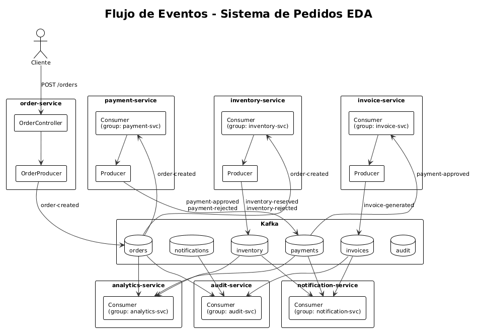

# Taller Kafka - Arquitecturas Orientadas por Eventos (EDA) — ARSW

**Escuela Colombiana de Ingeniería Julio Garavito**  
Programa de Ingeniería de Sistemas — Arquitecturas de Software

Autores; Juan Carlos Bohorquez Monroy, Carlos Andres Uribe Vargas
---

## Tabla de Contenido

- [Introducción](#introducción)
- [Capítulo 1. Evolución hacia arquitecturas orientadas por eventos](#capítulo-1-evolución-hacia-arquitecturas-orientadas-por-eventos)
- [Capítulo 2. Apache Kafka: fundamentos y arquitectura interna](#capítulo-2-apache-kafka-fundamentos-y-arquitectura-interna)
- [Capítulo 3. Preparación del entorno de laboratorio](#capítulo-3-preparación-del-entorno-de-laboratorio)
- [Capítulo 4. Productores y consumidores con Spring Boot](#capítulo-4-productores-y-consumidores-con-spring-boot)
- [Capítulo 5. Caso de estudio: sistema de pedidos basado en eventos](#capítulo-5-caso-de-estudio-sistema-de-pedidos-basado-en-eventos)
- [Capítulo 6. Laboratorio guiado extendido](#capítulo-6-laboratorio-guiado-extendido)
- [Capítulo 7. Manejo de errores, reintentos y Dead Letter Topics](#capítulo-7-manejo-de-errores-reintentos-y-dead-letter-topics)
- [Capítulo 8. Buenas prácticas de diseño con Kafka](#capítulo-8-buenas-prácticas-de-diseño-con-kafka)
- [Capítulo 9. Actividades de consolidación](#capítulo-9-actividades-de-consolidación)
- [Capítulo 10. Reto final, entregables y rúbrica](#capítulo-10-reto-final-entregables-y-rúbrica)

---

## Introducción

Las arquitecturas modernas requieren mecanismos de comunicación que permitan desacoplar servicios, procesar grandes volúmenes de eventos y responder de forma resiliente ante fallos parciales. Apache Kafka es una plataforma de *event streaming* que permite publicar, almacenar y consumir eventos de manera distribuida. Esta guía introduce los fundamentos arquitectónicos, técnicos y prácticos necesarios para comprender cuándo y cómo utilizar Kafka en sistemas basados en eventos.

**Objetivo general:** Comprender los principios de las arquitecturas orientadas por eventos y aplicar Apache Kafka en un laboratorio práctico con Docker, Kafka UI y Spring Boot.

**Herramientas:** Docker, Docker Compose, Kafka UI, Java 21, Maven y Spring Boot.

---

## Capítulo 1. Evolución hacia arquitecturas orientadas por eventos

### Contexto

El desarrollo de software ha evolucionado desde arquitecturas monolíticas y cliente-servidor hacia estilos más desacoplados como SOA y microservicios. La comunicación síncrona (REST) introduce acoplamiento temporal y riesgos de fallo en cadena. En contraste, las arquitecturas orientadas por eventos (EDA) utilizan un broker como intermediario, donde los productores publican eventos y los consumidores reaccionan de forma asíncrona. Un **evento** representa un hecho relevante del dominio (ej. `order-created`), y los elementos clave son: **productor**, **consumidor**, **broker** y **topic**. A diferencia de las colas tradicionales, en *event streaming* los eventos persisten durante un periodo definido, permitiendo múltiples consumidores, reprocesamiento y auditoría.

### Actividad 1. Análisis de comunicación

Clasifique qué procesos deberían ser síncronos, asíncronos o híbridos para una tienda en línea: *consultar productos, crear pedido, validar pago, enviar notificación, actualizar analítica y registrar auditoría*. Justifique brevemente su decisión.


| Proceso | Tipo | Arquitectura | Justificación principal |
|---------|------|-------------|----------------------|
| Consultar productos | **Síncrono** | REST / API Gateway + Caché | El usuario necesita ver el catálogo en tiempo real. Es una consulta de lectura pura donde la inmediatez importa. |
| Crear pedido | **Híbrido** | REST + Event Broker | El cliente recibe confirmación inmediata vía REST, pero los procesos posteriores (pago, inventario) se disparan como eventos asíncronos. |
| Validar pago | **Asíncrono** | Event Broker (Kafka) | No es necesario bloquear al cliente. El pago se procesa en segundo plano y se notifica el resultado mediante eventos. |
| Enviar notificación | **Asíncrono** | Event Broker (Kafka) | Enviar un correo o SMS no debe retrasar la respuesta al cliente. Es un efecto secundario que puede ocurrir en cualquier momento. |
| Actualizar analítica | **Asíncrono** | Event Broker (Kafka) | Los indicadores de negocio se construyen con datos históricos; no requieren respuesta inmediata y se benefician del reprocesamiento. |
| Registrar auditoría | **Asíncrono** | Event Broker (Kafka) | La trazabilidad debe registrarse sin bloquear el flujo principal. Kafka además conserva el evento original para auditorías forenses. |

---

#### Análisis por proceso — puntos de vista y arquitecturas involucradas

##### 1. Consultar productos — **Síncrono (REST)**

| Perspectiva | Argumento |
|-------------|-----------|
| **Usuario** | Espera ver productos al instante. Una respuesta lenta degrada la experiencia de compra. |
| **Arquitectura** | Una API REST con caché (Redis / CDN) ofrece la mejor latencia. Kafka no está diseñado para consultas puntuales ni devolución de respuestas inmediatas. |
| **Negocio** | Si el usuario no ve los productos, no compra. La disponibilidad y velocidad del catálogo impactan directamente las ventas. |
| **Alternativa** | Podría usarse GraphQL o gRPC si se necesita flexibilidad en las consultas, pero sigue siendo síncrono. |


---

##### 2. Crear pedido — **Híbrido (REST + Event Broker)**

| Perspectiva | Argumento |
|-------------|-----------|
| **Usuario** | Necesita saber que su pedido fue recibido (confirmación inmediata). No necesita esperar a que se valide el pago ni se reserve el inventario. |
| **Arquitectura** | REST recibe el pedido y responde 201 Created. Simultáneamente se publica un evento `order-created` en Kafka para que los servicios downstream procesen el resto. |
| **Negocio** | El pedido queda en estado `CREATED`. Si el pago falla después, se cancela y se notifica al cliente. Esto es **consistencia eventual**, aceptable para este dominio. |
| **Riesgo** | El cliente cree que su pedido está confirmado, pero podría ser cancelado si el pago se rechaza. Se mitiga con comunicación clara (ej. "Pedido recibido, pendiente de confirmación"). |

**Arquitectura recomendada:** REST (order-service) → Kafka (topic `orders`) → Consumer Groups (`payment-service`, `inventory-service`)

```
Cliente ─POST /orders─→ Order Service ──→ Kafka (orders topic)
                          ↓ 201 Created        ↓
                      Respuesta al      Payment Service (async)
                      cliente           Inventory Service (async)
```

---

##### 3. Validar pago — **Asíncrono (Kafka)**

| Perspectiva | Argumento |
|-------------|-----------|
| **Usuario** | No necesita esperar la validación bancaria en línea. Puede recibir una notificación después. |
| **Arquitectura** | El `payment-service` consume el evento `order-created` desde Kafka, procesa el pago y publica `payment-approved` o `payment-rejected`. Esto desacopla el pago del resto del sistema. |
| **Negocio** | La validación puede tomar segundos o minutos (ej. autenticación 3D Secure). Bloquear al cliente es inaceptable. |
| **Punto de vista crítico** | Podría argumentarse que validar el pago *antes* de confirmar el pedido evita ventas fallidas. Sin embargo, en la práctica se logra con un *hold* (pre-autorización) síncrono rápido y el resto asíncrono, manteniendo el modelo híbrido. |

**Arquitectura recomendada:** Kafka (topic `orders`) → payment-service (Consumer Group `payment-service`) → Kafka (topic `payments`)

---

##### 4. Enviar notificación — **Asíncrono (Kafka)**

| Perspectiva | Argumento |
|-------------|-----------|
| **Usuario** | La notificación puede llegar segundos o minutos después sin afectar su experiencia. |
| **Arquitectura** | El `notification-service` consume eventos de múltiples topics (`payments`, `inventory`, `invoices`) y envía correos/SMS sin acoplar al emisor original. |
| **Negocio** | Si el servicio de notificaciones falla, no debe impedir que el pedido se procese. Con Kafka, el evento persiste y se reprocesa cuando el servicio se recupere. |
| **Alternativa** | Para notificaciones críticas (ej. alerta de fraude) podría necesitarse sincronía, pero para una tienda en línea es un caso menor. |

**Arquitectura recomendada:** Kafka (varios topics) → notification-service → Proveedor de emails/SMS

---

##### 5. Actualizar analítica — **Asíncrono (Kafka)**

| Perspectiva | Argumento |
|-------------|-----------|
| **Usuario** | Es transparente para el usuario. No hay expectativa de inmediatez. |
| **Arquitectura** | El `analytics-service` consume eventos de forma independiente para construir dashboards, KPIs y reportes. Kafka permite reprocesar eventos históricos si se necesita recalcular métricas. |
| **Negocio** | La analítica se beneficia del *event sourcing*: cada evento es un hecho inmutable que alimenta indicadores sin afectar el flujo transaccional. |
| **Punto de vista crítico** | Si la analítica necesita datos en tiempo real (ej. detectar fraude durante la compra), podría requerirse un flujo híbrido con procesamiento rápido (Kafka Streams), pero sin cambiar a síncrono. |

**Arquitectura recomendada:** Kafka (todos los topics relevantes) → analytics-service → Base de datos analítica / Dashboard

---

##### 6. Registrar auditoría — **Asíncrono (Kafka)**

| Perspectiva | Argumento |
|-------------|-----------|
| **Usuario** | Es transparente. El usuario nunca espera a que se registre una auditoría. |
| **Arquitectura** | El `audit-service` consume eventos de todos los servicios. Kafka retiene los eventos (retención configurable), funcionando como un log de auditoría distribuido por sí mismo. |
| **Negocio** | La auditoría requiere trazabilidad completa e inmutable. Kafka garantiza orden por partición y persistencia, ideal para cumplimiento normativo (SOX, PCI-DSS). |
| **Punto de vista crítico** | Si una regulación exige que el registro de auditoría se haya completado antes de confirmar la transacción, entonces se necesitaría un enfoque híbrido con confirmación del audit-service antes de responder al cliente. |

**Arquitectura recomendada:** Kafka (topic `audit`) → audit-service → Almacenamiento de auditoría / Índice de búsqueda (Elasticsearch)

---

#### Resumen arquitectónico general

| Proceso | Estilo de comunicación | Broker de eventos | REST API | Caché | Consistencia |
|---------|----------------------|-------------------|----------|-------|-------------|
| Consultar productos | Síncrono | NO | SI | SI | Fuerte |
| Crear pedido | Híbrido | SI | SI | NO | Eventual |
| Validar pago | Asíncrono | SI | NO | NO | Eventual |
| Enviar notificación | Asíncrono | SI | NO | NO | Eventual |
| Actualizar analítica | Asíncrono | SI | NO | NO | Eventual |
| Registrar auditoría | Asíncrono | SI | NO | NO | Eventual |

> **Conclusión:** La tienda en línea requiere una **arquitectura híbrida** donde REST maneja las consultas y la confirmación inmediata, mientras que Kafka orquesta los procesos de negocio asíncronos. Esto maximiza desacoplamiento, escalabilidad y tolerancia a fallos, alineándose con los principios de EDA descritos en el capítulo 1.

</details>

---

## Capítulo 2. Apache Kafka: fundamentos y arquitectura interna

### Contexto

Apache Kafka es una plataforma distribuida de *event streaming* que funciona como un **log distribuido de eventos**. Sus componentes principales incluyen: **broker** (servidor Kafka), **cluster** (conjunto de brokers), **topic** (categoría lógica), **partición** (división física para paralelismo), **offset** (posición dentro de una partición), **producer**, **consumer**, **consumer group** (grupo que reparte particiones), **replica** (copia de seguridad), **leader/follower**, **ISR** (réplicas sincronizadas) y **retención** (tiempo/tamaño de conservación). Kafka garantiza orden solo dentro de una misma partición. La **clave de particionamiento** permite enrutar eventos relacionados (ej. `orderId`) a la misma partición. Los **Consumer Groups** permiten escalar el consumo: dentro de un grupo, cada partición es procesada por un solo consumidor, y grupos distintos reciben todos los eventos de forma independiente. En producción se recomienda replicación > 1 para tolerancia a fallos.

### Actividad 2. Decisiones de configuración

Analice una configuración con un topic `orders`, **una partición**, **factor de replicación 1**, **mensajes sin clave** y **retención de 24 horas**. Identifique riesgos y proponga mejoras para un ambiente productivo.


#### Análisis de la configuración propuesta

| Elemento | Configuración actual | Problema en producción |
|----------|---------------------|----------------------|
| Particiones | 1 | Sin paralelismo — un solo consumidor activo por grupo |
| Factor de replicación | 1 | Sin tolerancia a fallos — pérdida total si el broker cae |
| Clave | Sin clave (`null`) | Distribución aleatoria, sin orden por entidad |
| Retención | 24 horas | Ventana de reprocesamiento y auditoría muy corta |

---

#### Riesgos identificados

##### 1. Partición única — Cuello de botella y escalabilidad horizontal nula

| Perspectiva | Impacto |
|-------------|---------|
| **Rendimiento (throughput)** | Toda la escritura y lectura pasa por una sola partición. El límite es la capacidad de un solo broker. Si el volumen de pedidos crece, el topic `orders` se convierte en un cuello de botella. |
| **Paralelismo de consumo** | Dentro de un Consumer Group, **una partición solo puede ser asignada a un consumidor**. Si hay 3 réplicas del `payment-service`, solo 1 estará activa consumiendo; las otras 2 estarán inactivas. |
| **Recuperación** | Si un consumidor falla, el rebalanceo reasigna la partición, pero el reemplazo hereda toda la carga acumulada sin posibilidad de dividir el trabajo. |
| **Orden vs. escalabilidad** | Se sacrifica escalabilidad por un orden global que en realidad Kafka no necesita garantizar. |

**Ejemplo concreto:** Una tienda en línea procesa 10,000 pedidos/hora. Con 1 partición, el límite de escritura es ~1-5 MB/s. Cualquier pico navideño satura el broker. Con 6 particiones se distribuye la carga 6×.

##### 2. Factor de replicación 1 — Sin tolerancia a fallos (Single Point of Failure)

| Perspectiva | Impacto |
|-------------|---------|
| **Disponibilidad** | Si el broker se cae (fallo de hardware, reinicio, OOM), el topic `orders` deja de existir. Todos los eventos no consumidos se pierden permanentemente. |
| **Durabilidad** | No hay copia de seguridad. Un `kill -9` o un fallo de disco implica pérdida de datos. |
| **Mantenimiento** | No se puede reiniciar el broker de forma transparente. Cualquier actualización requiere ventana de mantenimiento con downtime. |
| **Recuperación ante desastre** | Si el datacenter falla, no hay réplica en otro rack o zona de disponibilidad. |


##### 3. Mensajes sin clave — Imposibilidad de orden por entidad y compactación

| Perspectiva | Impacto |
|-------------|---------|
| **Orden de eventos por pedido** | Si en el futuro se agregan más particiones, los eventos de un mismo `orderId` se distribuirán aleatoriamente entre particiones. No se podrá garantizar que `payment-approved` se procese después de `order-created` para el mismo pedido. |
| **Idempotencia del productor** | Kafka usa la clave para determinar la partición y para la deduplicación del productor idempotente. Sin clave, la idempotencia es más limitada. |
| **Log compaction** | La compactación de logs (retención basada en clave) no funciona sin clave. No se puede mantener el último estado de cada entidad. |
| **Distribución predecible** | Sin clave, el particionamiento sigue un round-robin o sticky partitioner, imposible de predecir o depurar. |

**Ejemplo concreto:** El pedido ORD-1001 pasa por varias etapas: `order-created` → `payment-approved` → `inventory-reserved`. Si algún sistema externo pregunta "¿cuál es el estado actual de ORD-1001?", sin clave no hay una manera eficiente de rastrear todos sus eventos.

##### 4. Retención de 24 horas — Reprocesamiento y auditoría limitados

| Perspectiva | Impacto |
|-------------|---------|
| **Reprocesamiento** | Si un consumidor falla por más de 24 horas (ej. fin de semana), al recuperarse ya no encontrará los eventos en Kafka. Se pierden para siempre. |
| **Auditoría y forense** | Una investigación posterior (ej. un chargeback de un pedido de hace 3 días) no podrá consultar los eventos originales. |
| **Analítica retrospectiva** | Si se necesita recalcular métricas del mes anterior, no es posible porque los eventos ya expiraron. |
| **Recuperación de errores** | Si un bug en el consumidor hace que procese incorrectamente eventos, y el bug se descubre después de 24 horas, no se puede re-procesar desde el origen. |

**Ejemplo concreto:** El `notification-service` tiene un bug que impide enviar notificaciones el 30 de junio. El bug se descubre el 2 de julio. Los eventos del 30 de junio ya expiraron (retención 24h). Todos esos pedidos se quedaron sin notificación y no hay forma de recuperarlos.

---

#### Mejoras propuestas para un ambiente productivo

| Problema | Mejora | Configuración recomendada | Atributo de calidad |
|----------|--------|--------------------------|---------------------|
| **1 partición** | Aumentar particiones para paralelismo y escalabilidad | `partitions: 6` (o `partitions: 3 × número de consumidores esperados`) | Escalabilidad, Rendimiento |
| **Replicación 1** | Aumentar factor de replicación con múltiples brokers | `replication-factor: 3`, mínimo 3 brokers en el cluster | Disponibilidad, Durabilidad |
| **Sin clave** | Usar `orderId` como clave de particionamiento | `key = orderId` en cada mensaje | Orden por entidad, Idempotencia |
| **Retención 24h** | Aumentar retención según necesidad de reprocesamiento y auditoría | `retention.ms: 604800000` (7 días) o retención infinita para auditoría | Mantenibilidad, Auditoría |

##### Configuración productiva recomendada

```yaml
# docker-compose.yml — Configuración básica para producción mínima
services:
  kafka-1:
    image: apache/kafka:3.7.0
    container_name: arsw-kafka-1
    ports:
      - "9092:9092"
    environment:
      KAFKA_NODE_ID: 1
      KAFKA_PROCESS_ROLES: broker,controller
      KAFKA_LISTENERS: PLAINTEXT://:9092,CONTROLLER://:9093
      KAFKA_ADVERTISED_LISTENERS: PLAINTEXT://localhost:9092
      KAFKA_CONTROLLER_LISTENER_NAMES: CONTROLLER
      KAFKA_LISTENER_SECURITY_PROTOCOL_MAP: CONTROLLER:PLAINTEXT,PLAINTEXT:PLAINTEXT
      KAFKA_CONTROLLER_QUORUM_VOTERS: 1@localhost:9093
      KAFKA_OFFSETS_TOPIC_REPLICATION_FACTOR: 3
      KAFKA_TRANSACTION_STATE_LOG_REPLICATION_FACTOR: 3
      KAFKA_TRANSACTION_STATE_LOG_MIN_ISR: 2
      KAFKA_GROUP_INITIAL_REBALANCE_DELAY_MS: 3000
      KAFKA_NUM_PARTITIONS: 3
```

```bash
# Creación del topic orders para producción
kafka-topics.sh --create \
  --topic orders \
  --bootstrap-server localhost:9092 \
  --partitions 6 \
  --replication-factor 3 \
  --config retention.ms=604800000 \
  --config min.insync.replicas=2
```

##### Análisis de impacto de las mejoras

| Atributo de calidad | Antes | Después |
|---------------------|-------|---------|
| **Escalabilidad** | Fallo. 1 partición = 1 consumidor activo | Check. 6 particiones = hasta 6 consumidores en paralelo |
| **Disponibilidad** | Fallo. Replicación 1 = caída del broker = pérdida total | Check. Replicación 3 = tolerancia a 2 brokers caídos |
| **Durabilidad** | Fallo. Sin copia = pérdida de datos en fallo. | Check. ISR mínimo 2 = datos seguros aunque 1 broker falle |
| **Orden por entidad** | Fallo. Sin clave = distribución aleatoria | Check. `orderId` como clave = orden garantizado por pedido |
| **Reprocesamiento** | Fallo. 24h = ventana mínima | Check. 7 días = recuperación ante errores prolongados |
| **Auditoría** | Fallo. Eventos expiran antes de detectar problemas | Check. Retención extendida permite trazabilidad forense |

> **Conclusión:** La configuración original es aceptable únicamente para un laboratorio local o entorno de desarrollo. Para producción se requieren **múltiples particiones** (escalabilidad), **factor de replicación ≥ 2** (disponibilidad), **claves de particionamiento** (orden y consistencia) y **retención extendida** (reprocesamiento y auditoría).

</details>

---

## Capítulo 3. Preparación del entorno de laboratorio

### Contexto

El laboratorio utiliza **Docker** para ejecutar Kafka en modo **KRaft** (sin ZooKeeper) y **Kafka UI** como herramienta visual. Se proporciona un archivo `docker-compose.yml` con un broker Kafka y la interfaz web en el puerto `8080`. El broker queda expuesto en `localhost:9092`. Se incluyen comandos básicos para crear topics, describirlos, publicar y consumir eventos desde la terminal usando los scripts de Kafka.

### Actividad 3. Actividad práctica

Cree los topics `orders`, `payments` e `inventory`. Publique al menos cinco eventos JSON y verifique en Kafka UI su topic, partición, offset, clave y contenido.

<details>
<summary><b>Desarrollo de la Actividad 3</b></summary>

**Entorno levantado:**

Se creó `docker-compose.yml` con dos servicios: `kafka` (Apache Kafka 3.7.0 en modo KRaft, sin ZooKeeper, puerto `9092`) y `kafka-ui` (interfaz visual Provectus, puerto `8080`), conectados a través de la red interna de Docker bajo el cluster `arsw-local`.

```bash
docker compose up -d
docker ps
```

**Incidente y corrección:**

El `advertised.listeners` inicial apuntaba a `localhost:9092`, lo cual funciona para clientes dentro del propio contenedor de Kafka, pero impide que **otros contenedores** (como Kafka UI) lo resuelvan, ya que cada contenedor tiene su propio `localhost`. Esto se evidenció con Kafka UI mostrando 0 brokers y la pantalla de Topics cargando indefinidamente (error 500), con logs mostrando `Connection to node 1 (localhost/127.0.0.1:9092) could not be established`.

**Solución:** cambiar el advertised listener para usar el nombre del servicio dentro de la red de Docker:

```yaml
KAFKA_ADVERTISED_LISTENERS: PLAINTEXT://kafka:9092
```

Esto no afecta la conexión desde la máquina host (por ejemplo, una futura app Spring Boot corriendo en `localhost`), porque el puerto sigue mapeado a `localhost:9092` hacia afuera del contenedor.

**Comandos utilizados:**

```bash
docker exec -it arsw-kafka bash

# Crear topics
/opt/kafka/bin/kafka-topics.sh --create --topic orders --bootstrap-server localhost:9092 --partitions 3 --replication-factor 1
/opt/kafka/bin/kafka-topics.sh --create --topic payments --bootstrap-server localhost:9092 --partitions 3 --replication-factor 1
/opt/kafka/bin/kafka-topics.sh --create --topic inventory --bootstrap-server localhost:9092 --partitions 3 --replication-factor 1

# Verificar
/opt/kafka/bin/kafka-topics.sh --list --bootstrap-server localhost:9092

# Publicar eventos
/opt/kafka/bin/kafka-console-producer.sh --topic orders --bootstrap-server localhost:9092
```

**Eventos publicados (topic `orders`):**

```json
{"orderId":"ORD-1001","customerId":"CUS-01","total":120000,"status":"CREATED"}
{"orderId":"ORD-1002","customerId":"CUS-02","total":85000,"status":"CREATED"}
{"orderId":"ORD-1003","customerId":"CUS-03","total":260000,"status":"CREATED"}
{"orderId":"ORD-1004","customerId":"CUS-01","total":45000,"status":"CREATED"}
{"orderId":"ORD-1005","customerId":"CUS-04","total":310000,"status":"CREATED"}
```

| # | Topic | Clave | Partición | Offset | Contenido |
|---|-------|-------|-----------|--------|-----------|
| 1 | orders | (vacía) | 0 | 0 | ORD-1001, CUS-01, 120000 |
| 2 | orders | (vacía) | 0 | 1 | ORD-1002, CUS-02, 85000 |
| 3 | orders | (vacía) | 0 | 2 | ORD-1003, CUS-03, 260000 |
| 4 | orders | (vacía) | 0 | 3 | ORD-1004, CUS-01, 45000 |
| 5 | orders | (vacía) | 0 | 4 | ORD-1005, CUS-04, 310000 |

**Hallazgo / análisis:**

Los 5 eventos cayeron **todos en la partición 0**, a pesar de tener 3 particiones disponibles. Esto se explica porque los mensajes se publicaron **sin clave** (key vacía): sin clave, el cliente productor no garantiza una distribución uniforme inmediata; las versiones recientes del cliente usan una estrategia "sticky" que agrupa mensajes consecutivos en la misma partición por lotes antes de rotar, en lugar de repartir uno a uno entre particiones.

Esto evidencia en la práctica el riesgo que se plantea en la **Actividad 2 (Decisiones de configuración)**: una configuración sin clave de particionamiento puede concentrar la carga en una sola partición, afectando el paralelismo y el balanceo entre consumidores de un mismo grupo.

**Topics creados (verificación en Kafka UI):**

| Topic | Partitions | Replication Factor | Number of messages |
|-------|-----------|---------------------|---------------------|
| inventory | 3 | 1 | 0 |
| orders | 3 | 1 | 5 |
| payments | 3 | 1 | 0 |

</details>

---

## Capítulo 4. Productores y consumidores con Spring Boot

### Contexto

Se implementa una aplicación Spring Boot con productor y consumidor Kafka. La configuración se define en `application.yml` con `bootstrap-servers: localhost:9092`, serializador JSON (`JsonSerializer`/`JsonDeserializer`) y `group-id: order-service`. Se define el evento de dominio `OrderCreatedEvent` con atributos `orderId`, `customerId`, `total`, `status` y `occurredAt`. El productor usa `KafkaTemplate` para publicar en el topic `orders` usando `orderId` como clave. El consumidor usa `@KafkaListener`. Un `@RestController` expone un endpoint `POST /orders` que recibe la solicitud HTTP y publica el evento.

### Actividad 4. Trazabilidad del evento

Documente el recorrido del evento desde la solicitud HTTP hasta el consumidor. Indique topic, clave, partición, consumidor, Consumer Group y evidencia en Kafka UI.


#### Recorrido completo del evento

```
┌─────────┐   POST /orders    ┌────────────────┐   KafkaTemplate.send()    ┌──────────┐   Consume   ┌──────────────────────┐
│ Cliente │ ────────────────→ │ OrderController │ ──────────────────────→ │ Kafka     │ ────────→ │ InventoryEventConsumer │
│ (curl)  │                   │ (RestController) │                         │ (Broker)  │           │ (groupId=inventory)   │
└─────────┘                   └────────────────┘                         └──────────┘           └──────────────────────┘
                                 │                                            │                          │
                                 │ 1. Crea OrderCreatedEvent                   │ 2. Asigna partición       │ 4. Procesa evento
                                 │    (orderId, customerId,                     │    usando hash(orderId)   │
                                 │     total, status, occurredAt)               │    % numPartitions        │
                                 │                                            │                          │
                                 │                                            │ 3. Almacena con offset    │
                                 │                                            │    secuencial            │
                                 ▼                                            ▼                          ▼
                           HTTP 201 Created                          Kafka UI en                      Console output:
                           + JSON del evento                         http://localhost:8080            "Evento recibido en
                                                                                                       inventory-service: ORD-..."
```

---

#### Paso a paso detallado

##### Paso 1: Solicitud HTTP (Cliente → OrderController)

```bash
curl -X POST http://localhost:8081/orders \
  -H "Content-Type: application/json" \
  -d '{"customerId":"CUS-01","total":120000}'
```

El cliente envía un `POST` al endpoint `/orders` del `order-service` corriendo en el puerto `8081`.

##### Paso 2: Controlador crea el evento

```java
OrderCreatedEvent event = new OrderCreatedEvent(
    "ORD-" + UUID.randomUUID(),     // orderId = "ORD-a1b2c3d4-e5f6-..."
    request.getCustomerId(),        // "CUS-01"
    request.getTotal(),             // 120000
    "CREATED",                      // status inicial
    Instant.now()                   // occurredAt
);
```

El controlador construye el evento de dominio con:
| Campo | Valor ejemplo | Descripción |
|-------|---------------|-------------|
| `orderId` | `ORD-a1b2c3d4-e5f6-7890-abcd` | Identificador único del pedido |
| `customerId` | `CUS-01` | Cliente que realiza la compra |
| `total` | `120000` | Monto total del pedido |
| `status` | `CREATED` | Estado inicial |
| `occurredAt` | `2026-06-30T10:00:00Z` | Marca de tiempo del evento |

##### Paso 3: Productor publica en Kafka

```java
kafkaTemplate.send("orders", event.getOrderId(), event);
```

`KafkaTemplate.send(topic, key, value)` realiza lo siguiente:
1. **Serializa la clave** con `StringSerializer` → `"ORD-a1b2c3d4-..."`
2. **Serializa el valor** con `JsonSerializer` → `{"orderId":"ORD-...","customerId":"CUS-01","total":120000,"status":"CREATED","occurredAt":"2026-06-30T10:00:00Z"}`
3. **Calcula la partición**: `partition = hash(key) % numPartitions`

---

##### Paso 4: Kafka asigna partición y offset

Con `KAFKA_NUM_PARTITIONS: 3` en el `docker-compose.yml`, el topic `orders` tiene **3 particiones**.

| Clave (`orderId`) | Hash | Partición asignada | ¿Por qué? |
|-------------------|------|-------------------|-----------|
| `ORD-a1b2c3d4-...` | `hash("ORD-...")` | `0`, `1` o `2` | `Math.abs(hashCode) % 3` |

**Detalle del cálculo de partición:**

```
hash("ORD-a1b2c3...") = 123456789
partition = 123456789 % 3 = 0  →  Partition 0
```

El productor envía el registro al líder de la partición `0`. El broker:
1. Asigna un **offset secuencial** dentro de la partición (ej. offset `42`)
2. Almacena el evento
3. Confirma la escritura al productor

```
Topic: orders
  Partition 0: [offset 40, offset 41, offset 42 ← NUEVO, ...]
  Partition 1: [offset 15, offset 16, ...]
  Partition 2: [offset 28, offset 29, ...]
```

> **Nota:** La misma clave (`orderId`) siempre produce el mismo hash, por lo que **todos los eventos del mismo pedido caen en la misma partición**, garantizando orden por entidad.

##### Paso 5: Consumidor recibe el evento

```java
@Service
public class InventoryEventConsumer {

    private final InventoryEventProducer inventoryProducer;

    public InventoryEventConsumer(InventoryEventProducer inventoryProducer) {
        this.inventoryProducer = inventoryProducer;
    }

    @KafkaListener(topics = "orders", groupId = "inventory-service")
    public void consume(OrderCreatedEvent event) {
        System.out.println("Inventory Service: procesando pedido " + event.getOrderId());

        boolean reserved = event.getTotal() <= 300000;

        InventoryProcessedEvent inventoryEvent = new InventoryProcessedEvent(
                "INV-" + UUID.randomUUID(),
                event.getOrderId(),
                event.getCustomerId(),
                reserved ? "RESERVED" : "REJECTED",
                Instant.now()
        );

        inventoryProducer.publish(inventoryEvent);
        System.out.println("Inventory Service: " + inventoryEvent.getStatus() + " para pedido " + event.getOrderId());
    }
}
```

El `InventoryEventConsumer` pertenece al Consumer Group **`inventory-service`**. Kafka asigna las particiones del topic `orders` a los consumidores activos dentro de este grupo. Este consumidor no solo registra el evento, sino que también ejecuta la lógica de negocio de inventario y publica el resultado en el topic `inventory`.

**Asignación de particiones (1 consumidor, 3 particiones):**

| Consumidor | Particiones asignadas |
|------------|----------------------|
| `InventoryEventConsumer` (único) | `0`, `1`, `2` |

Si hubiera **3 instancias** del `inventory-service`:

| Consumidor | Particiones asignadas |
|------------|----------------------|
| `InventoryEventConsumer-1` | `0` |
| `InventoryEventConsumer-2` | `1` |
| `InventoryEventConsumer-3` | `2` |

Esto permite escalar horizontalmente: más consumidores = más paralelismo.

##### Paso 6: Consumidor deserializa y procesa

El `JsonDeserializer` convierte el JSON recibido de vuelta a un objeto `OrderCreatedEvent`. El método `consume()` imprime:

```
Evento recibido en inventory-service: ORD-a1b2c3d4-e5f6-7890-abcd
```

---

#### Evidencia en Kafka UI

Kafka UI está disponible en **http://localhost:8080**. Para verificar la trazabilidad:

| Pantalla | Qué observar | Información |
|----------|-------------|-------------|
| **Topics → orders → Partitions** | Lista de particiones (0, 1, 2) | Número de particiones configurado (3) |
| **Topics → orders → Messages** | Mensajes publicados en orden | Cada mensaje muestra: offset, key, value, timestamp |
| **Consumers → inventory-service** | Grupo de consumidores activo | Asignación de particiones por consumidor |
| **Consumers → inventory-service → Lag** | Diferencia entre último offset y offset consumido | Lag = 0 si está al día, > 0 si hay atraso |

**Ejemplo de lo que se ve en Kafka UI para un mensaje:**

| Offset | Key | Value | Partition | Timestamp |
|--------|-----|-------|-----------|-----------|
| 42 | `ORD-a1b2c3d4-e5f6-7890-abcd` | `{"orderId":"ORD-...","customerId":"CUS-01","total":120000,"status":"CREATED","occurredAt":"2026-06-30T10:00:00Z"}` | 0 | 2026-06-30 10:00:00 |
| 43 | `ORD-ffffffff-eeee-dddd-cccc-bbbbbbbbbbbb` | `{"orderId":"ORD-...","customerId":"CUS-02","total":85000,"status":"CREATED","occurredAt":"2026-06-30T10:01:00Z"}` | 1 | 2026-06-30 10:01:00 |

> **Importante:** Al hacer clic en un mensaje en Kafka UI, se puede ver el contenido completo del JSON, confirmando que el evento llegó correctamente con todos sus campos.

---

#### Resumen de trazabilidad

| Elemento solicitado | Valor |
|---------------------|-------|
| **Topic** | `orders` |
| **Clave** | `orderId` (ej. `ORD-a1b2c3d4-e5f6-7890-abcd`) |
| **Partición** | Determinada por `hash(orderId) % 3` → `0`, `1` o `2` |
| **Offset** | Secuencial por partición (ej. `42`, `43`, ...) |
| **Consumidor** | `InventoryEventConsumer.consume()` |
| **Consumer Group** | `inventory-service` (definido en `@KafkaListener`) |
| **Endpoint HTTP** | `POST http://localhost:8081/orders` |
| **Serialización** | Key: `StringSerializer`, Value: `JsonSerializer` |
| **Deserialización** | Key: `StringDeserializer`, Value: `JsonDeserializer` |
| **Evidencia Kafka UI** | Topics → orders → Messages → ver key, value, partition, offset |

---

#### Puntos clave de la trazabilidad

1. **La clave `orderId` garantiza orden por pedido**: todas las actualizaciones del mismo pedido caen en la misma partición
2. **3 particiones permiten hasta 3 consumidores en paralelo** dentro del mismo Consumer Group
3. **El Consumer Group `inventory-service` es diferente al `group-id` por defecto** (`order-service`): el `application.yml` define un valor por defecto, pero `@KafkaListener` lo sobrescribe
4. **El lag en Kafka UI** indica si el consumidor está procesando eventos al mismo ritmo que se producen
5. **El evento persiste en Kafka** aunque el consumidor haya procesado (gracias a la retención configurada)

**Comando de verificación en terminal:**

```bash
# Ver offsets del grupo inventory-service
kafka-consumer-groups.sh --bootstrap-server localhost:9092 \
  --group inventory-service --describe

# Output esperado:
# GROUP              TOPIC   PARTITION  CURRENT-OFFSET  LOG-END-OFFSET  LAG
# inventory-service  orders  0          42              42              0
# inventory-service  orders  1          16              16              0
# inventory-service  orders  2          29              29              0
```
</details>

---

## Capítulo 5. Caso de estudio: sistema de pedidos basado en eventos

### Contexto

Una plataforma de comercio electrónico desea desacoplar los procesos de pedidos, pagos, inventario, facturación, notificaciones, analítica y auditoría usando Kafka. Se proponen 7 servicios lógicos (order-service, payment-service, inventory-service, invoice-service, notification-service, analytics-service, audit-service) y 6 topics (`orders`, `payments`, `inventory`, `invoices`, `notifications`, `audit`). La comunicación asíncrona introduce **consistencia eventual**: el pedido avanza por estados (CREATED → PAYMENT_APPROVED → INVENTORY_RESERVED → CONFIRMED/CANCELLED). No todo debe ser asíncrono — consultas como catálogo o autenticación pueden mantenerse con REST.

### Actividad 5. Diseño del flujo

Proponga los eventos, topics, productores, consumidores, Consumer Groups y claves de particionamiento para el flujo de compra. Justifique por qué no conviene usar un único topic global llamado `events`.

<details>
<summary><b>Desarrollo de la Actividad 5</b></summary>

#### Diagrama de flujo general


*Fuente: `diagrams/actividad_5_flujo.puml`*

Para regenerar la imagen desde el archivo PlantUML:

```bash
plantuml diagrams/actividad_5_flujo.puml
```

---

#### Máquina de estados del pedido

Cada pedido atraviesa los siguientes estados, reflejados por los eventos que se publican:

```
                    ┌──────────────┐
                    │   CREATED    │  ← order-created (order-service)
                    └──────┬───────┘
                           │
              ┌────────────┼────────────┐
              │            │            │
              ▼            ▼            ▼
    ┌──────────────┐ ┌──────────┐ ┌──────────┐
    │ PAYMENT_     │ │INVENTORY_│ │CANCELLED │
    │ APPROVED     │ │RESERVED  │ │          │
    └──────┬───────┘ └─────┬────┘ └──────────┘
           │               │
           └───────┬───────┘
                   ▼
          ┌──────────────┐
          │  CONFIRMED   │  ← invoice-generated
          └──────────────┘
```

Los eventos `payment-rejected`, `inventory-rejected` o `order-cancelled` llevan al estado `CANCELLED`.

---

#### Tabla completa de eventos, productores, consumidores y grupos

| Evento | Topic | Productor | Consumidores | Consumer Group | Clave | ¿Por qué esa clave? |
|--------|-------|-----------|-------------|----------------|-------|-------------------|
| `order-created` | `orders` | order-service | payment-service, inventory-service, analytics-service, audit-service | `payment-svc`, `inventory-svc`, `analytics-svc`, `audit-svc` | `orderId` | Todos los eventos del mismo pedido caen en la misma partición |
| `order-cancelled` | `orders` | cualquier servicio | payment-service, inventory-service, notification-service, audit-service | `payment-svc`, `inventory-svc`, `notification-svc`, `audit-svc` | `orderId` | Misma entidad de negocio |
| `payment-approved` | `payments` | payment-service | invoice-service, notification-service, analytics-service, audit-service | `invoice-svc`, `notification-svc`, `analytics-svc`, `audit-svc` | `orderId` | Relación 1:1 con el pedido |
| `payment-rejected` | `payments` | payment-service | notification-service, analytics-service, audit-service | `notification-svc`, `analytics-svc`, `audit-svc` | `orderId` | Misma correlación con pedido |
| `inventory-reserved` | `inventory` | inventory-service | notification-service, analytics-service, audit-service | `notification-svc`, `analytics-svc`, `audit-svc` | `orderId` | Misma correlación con pedido |
| `inventory-rejected` | `inventory` | inventory-service | notification-service, analytics-service, audit-service | `notification-svc`, `analytics-svc`, `audit-svc` | `orderId` | Misma correlación con pedido |
| `invoice-generated` | `invoices` | invoice-service | notification-service, analytics-service, audit-service | `notification-svc`, `analytics-svc`, `audit-svc` | `orderId` | Asociado al pedido |
| `notification-sent` | `notifications` | notification-service | analytics-service, audit-service | `analytics-svc`, `audit-svc` | `orderId` | Seguimiento por pedido |
| `audit-record-created` | `audit` | todos | audit-service | `audit-svc` | `correlationId` | Agrupa toda la trazabilidad de una transacción completa |

---

#### Consistencia eventual — línea de tiempo de un pedido exitoso

```
Tiempo →

order-created  ──────→ payment-approved ──────→ inventory-reserved ──────→ invoice-generated ──────→ notification-sent
(orders topic)         (payments topic)          (inventory topic)          (invoices topic)          (notifications topic)

Estado orden:  CREATED ───► PAYMENT_APPROVED ───► INVENTORY_RESERVED ───► CONFIRMED ───► NOTIFIED
```

Entre cada paso, los servicios downstream pueden estar en diferentes estados de procesamiento. Esto es **consistencia eventual**: no hay una transacción distribuida que garantice que todos los servicios estén sincronizados al mismo instante.

---

#### Análisis: ¿Por qué NO usar un único topic global `events`?

##### 1. Mezcla de eventos de diferente dominio y cardinalidad

| Aspecto | Topic único `events` | Topics por dominio |
|---------|---------------------|-------------------|
| **Eventos mezclados** | `order-created`, `payment-approved`, `notification-sent`, `audit-record-created` todo en el mismo lugar | Cada topic contiene solo eventos de un dominio (`orders`, `payments`, `inventory`, ...) |
| **Clave de particionamiento** | Imposible elegir una clave única — `orderId` no sirve para eventos de auditoría que usan `correlationId` | Cada topic tiene la clave adecuada a su dominio |
| **Consumidores** | Un consumidor de `payment-service` recibe también eventos de `notification-sent` que no le interesan, desperdiciando recursos y ancho de banda | Cada consumidor solo recibe los eventos de los topics que le corresponden |
| **Rendimiento** | Un solo topic concentra todo el throughput del sistema, creando un cuello de botella | El throughput se distribuye entre múltiples topics |

**Ejemplo concreto:** El `payment-service` necesita consumir solo `order-created`. Con un topic único `events`, recibe también `notification-sent`, `invoice-generated`, `audit-record-created`, etc. — eventos que debe filtrar del lado del consumidor, aumentando la carga innecesariamente.

##### 2. Dificultad para configurar políticas específicas por tipo de evento

| Política | Topic único `events` | Topics por dominio |
|----------|---------------------|-------------------|
| **Retención** | Una sola retención para todos los eventos. Auditoría necesita retención larga (90+ días), notificaciones pueden ser cortas (24h). Forzado a elegir el mínimo común denominador. | Cada topic configura su retención según necesidad: `audit: 90 días`, `notifications: 7 días`, `orders: 30 días` |
| **Particiones** | Un número de particiones para todos los eventos. `audit` tiene alto volumen (100k eventos/día) vs `invoices` bajo volumen (1k/día). | Cada topic ajusta particiones según su volumen: `audit: 12 particiones`, `invoices: 3 particiones` |
| **Compresión** | No se puede aplicar compresión selectiva. | Topics de alto volumen pueden usar compresión `snappy` o `zstd` |
| **DLT (Dead Letter Topic)** | Los DLT se mezclarían: `events.DLT` contendría fallos de todos los servicios sin distinción. | Cada topic tiene su propio DLT: `orders.DLT`, `payments.DLT`, `inventory.DLT` |

**Ejemplo concreto:** La auditoría necesita conservar eventos por 90 días por cumplimiento normativo (SOX). Las notificaciones solo necesitan 24 horas. Con un topic único, se elige 90 días para todos, duplicando el almacenamiento innecesario de notificaciones; o se elige 24 horas y se pierden los registros de auditoría.

##### 3. Dificultad para asignar permisos y control de acceso

| Aspecto | Topic único `events` | Topics por dominio |
|---------|---------------------|-------------------|
| **ACLs** | Un solo conjunto de permisos. Todos los servicios pueden leer/escribir todos los eventos. Un bug en `notification-service` podría contaminar eventos de pago. | ACLs granulares: `payment-service` solo escribe en `payments`, `inventory-service` solo en `inventory` |
| **Aislamiento** | No hay aislamiento entre dominios. | Cada dominio es independiente. |
| **Seguridad** | Cualquier servicio malicioso o con bug puede afectar todos los eventos del sistema. | El daño está contenido dentro del dominio del servicio. |

##### 4. Dificultad para evolucionar y versionar eventos

| Aspecto | Topic único `events` | Topics por dominio |
|---------|---------------------|-------------------|
| **Evolución de esquema** | Si `OrderCreatedEvent` agrega un campo, el cambio afecta a todos los consumidores de `events`, incluso a los que solo procesan `notification-sent` | Solo afecta a los consumidores del topic `orders` |
| **Compatibilidad hacia atrás** | Más difícil de mantener cuando todos los esquemas conviven en el mismo topic | Cada dominio puede versionarse de forma independiente |
| **Múltiples versiones** | El schema registry debe manejar versiones de múltiples dominios en un solo sujeto | Cada topic tiene su propio sujeto en el schema registry |

##### 5. Sin aislamiento de fallos

```
Topic único events:
  payment-service falla → el consumer group se atasca → el lag crece
  → TODOS los eventos se retrasan (orders, inventory, notifications, audit)
  → El sistema completo se degrada

Topics separados:
  payment-service falla → el lag crece solo en payments topic
  → orders, inventory, notifications, audit siguen funcionando normalmente
  → El resto del sistema no se ve afectado
```

##### 6. Dificultad para monitorear y depurar

| Aspecto | Topic único `events` | Topics por dominio |
|---------|---------------------|-------------------|
| **Lag** | Un solo valor de lag mezcla eventos de todos los dominios. Difícil saber qué servicio está atrasado. | Lag por topic: `orders-lag=0`, `payments-lag=5000`, `inventory-lag=0`. Se identifica al instante que `payment-service` está fallando. |
| **Trazabilidad** | Para rastrear un pedido, hay que filtrar manualmente dentro de un mar de eventos no relacionados. | Cada topic tiene eventos de un solo dominio. Rastrear un pedido es trivial. |
| **Alertas** | Una alerta de lag alto no distingue qué servicio está fallando. | Alertas específicas por topic = diagnóstico inmediato. |

**Ejemplo concreto:** El `payment-service` deja de funcionar a las 3:00 AM. Con topics separados, una alerta muestra `payments-lag=15000`. El equipo sabe que debe revisar `payment-service`. Con un topic único, la alerta muestra `events-lag=15000` y el equipo debe investigar qué consumidor está fallando entre todos los servicios.

---

#### Resumen de justificación

| Razón | Impacto |
|-------|---------|
| **Separación de dominios** | Cada servicio consume solo lo que necesita — eficiencia de red y procesamiento |
| **Políticas específicas** | Retención, particiones y compresión adaptadas a cada tipo de evento |
| **Aislamiento de fallos** | Un fallo en un servicio no bloquea los eventos de otros dominios |
| **Seguridad y ACLs** | Permisos granulares por dominio, menor superficie de ataque |
| **Evolución independiente** | Cada dominio versiona sus eventos sin afectar a los demás |
| **Monitoreo granular** | Lag, throughput y errores medibles por dominio, diagnóstico inmediato |
| **Claves de particionamiento coherentes** | Cada topic usa la clave adecuada a su entidad (`orderId`, `correlationId`) |

> **Conclusión:** Un topic único `events` viola el principio de **separación de responsabilidades** (Single Responsibility Principle) aplicado a la infraestructura de eventos. La organización por dominios con topics dedicados mejora escalabilidad, mantenibilidad, observabilidad y seguridad — exactamente los atributos de calidad que Kafka busca proporcionar.

---

## Capítulo 6. Laboratorio guiado extendido

### Contexto

El estudiante extiende la aplicación para que el evento `order-created` genere eventos posteriores de pagos e inventario. Se definen 3 topics obligatorios (`orders`, `payments`, `inventory`) y 3 eventos (`OrderCreatedEvent`, `PaymentProcessedEvent`, `InventoryProcessedEvent`). El flujo esperado: cliente crea pedido → order-service publica → payment-service y inventory-service consumen y publican resultados → notification-service y analytics-service reaccionan. Los consumidores de pago e inventario tienen lógica de negocio simplificada (aprueban según umbrales de total).

### Actividad 6. Evidencia y análisis

Cree pedidos con valores diferentes y reconstruya el flujo de eventos en Kafka UI. Identifique eventos generados, topics, claves, Consumer Groups, offsets y lag.

<details>
<summary><b>Desarrollo de la Actividad 6</b></summary>

---

#### Paso 1: Crear los pedidos (3 valores diferentes)

Ejecutar los siguientes comandos `curl` contra el endpoint `POST /orders` del `order-service`:

```bash
# Pedido 1: total bajo → pago APROBADO + inventario RESERVADO
curl -X POST http://localhost:8081/orders \
  -H "Content-Type: application/json" \
  -d '{"customerId":"CUS-01","total":100000}'

# Pedido 2: total medio → pago RECHAZADO (>250k) + inventario RESERVADO (≤300k)
curl -X POST http://localhost:8081/orders \
  -H "Content-Type: application/json" \
  -d '{"customerId":"CUS-02","total":260000}'

# Pedido 3: total alto → pago RECHAZADO + inventario RECHAZADO (>300k)
curl -X POST http://localhost:8081/orders \
  -H "Content-Type: application/json" \
  -d '{"customerId":"CUS-03","total":350000}'
```

Cada pedido devuelve `201 Created` con el JSON del `OrderCreatedEvent`, incluyendo un `orderId` generado con UUID.

---

#### Paso 2: Resultados esperados según la lógica de negocio

| Pedido | Total | Regla Pago (≤ 250k) | Regla Inventario (≤ 300k) | Resultado Pago | Resultado Inventario |
|--------|-------|---------------------|--------------------------|----------------|---------------------|
| ORD-001 | 100000 | ✅ ≤ 250000 | ✅ ≤ 300000 | ✅ **APPROVED** | ✅ **RESERVED** |
| ORD-002 | 260000 | ❌ > 250000 | ✅ ≤ 300000 | ❌ **REJECTED** | ✅ **RESERVED** |
| ORD-003 | 350000 | ❌ > 250000 | ❌ > 300000 | ❌ **REJECTED** | ❌ **REJECTED** |

---

#### Paso 3: Reconstrucción del flujo en Kafka UI

Navegar a **http://localhost:8080** y seguir estos pasos para reconstruir el flujo de cada pedido:

**3.1 — Verificar topics creados**
- Ir a **Topics** → deben aparecer `orders`, `payments`, `inventory` (3 particiones cada uno)

**3.2 — Rastrear ORD-001 (flujo completo exitoso)**
```
1. Topics → orders → Messages → buscar "ORD-001" en key/valor
   → Ver: order-created con status "CREATED"
2. Topics → payments → Messages → buscar "ORD-001"
   → Ver: payment-processed con status "APPROVED"
3. Topics → inventory → Messages → buscar "ORD-001"
   → Ver: inventory-processed con status "RESERVED"
```

**3.3 — Rastrear ORD-002 (pago rechazado, inventario reservado)**
```
1. Topics → orders → Messages → buscar "ORD-002"
   → Ver: order-created con status "CREATED"
2. Topics → payments → Messages → buscar "ORD-002"
   → Ver: payment-processed con status "REJECTED"
3. Topics → inventory → Messages → buscar "ORD-002"
   → Ver: inventory-processed con status "RESERVED"
```

**3.4 — Rastrear ORD-003 (todo rechazado)**
```
1. Topics → orders → Messages → buscar "ORD-003"
   → Ver: order-created con status "CREATED"
2. Topics → payments → Messages → buscar "ORD-003"
   → Ver: payment-processed con status "REJECTED"
3. Topics → inventory → Messages → buscar "ORD-003"
   → Ver: inventory-processed con status "REJECTED"
```

---

#### Paso 4: Eventos generados (resumen completo)

| # | Evento | Topic | Clave | Partición (probable) | Offset (ejemplo) | Consumer Group (consumidor) |
|---|--------|-------|-------|---------------------|------------------|----------------------------|
| 1 | `order-created` | `orders` | ORD-001 | hash(ORD-001) % 3 | 0 | `payment-service`, `inventory-service`, `analytics-service` |
| 2 | `payment-approved` | `payments` | ORD-001 | hash(ORD-001) % 3 | 0 | `notification-service`, `analytics-service` |
| 3 | `inventory-reserved` | `inventory` | ORD-001 | hash(ORD-001) % 3 | 0 | `notification-service`, `analytics-service` |
| 4 | `order-created` | `orders` | ORD-002 | hash(ORD-002) % 3 | 1 | `payment-service`, `inventory-service`, `analytics-service` |
| 5 | `payment-rejected` | `payments` | ORD-002 | hash(ORD-002) % 3 | 1 | `notification-service`, `analytics-service` |
| 6 | `inventory-reserved` | `inventory` | ORD-002 | hash(ORD-002) % 3 | 1 | `notification-service`, `analytics-service` |
| 7 | `order-created` | `orders` | ORD-003 | hash(ORD-003) % 3 | 2 | `payment-service`, `inventory-service`, `analytics-service` |
| 8 | `payment-rejected` | `payments` | ORD-003 | hash(ORD-003) % 3 | 2 | `notification-service`, `analytics-service` |
| 9 | `inventory-rejected` | `inventory` | ORD-003 | hash(ORD-003) % 3 | 2 | `notification-service`, `analytics-service` |

---

#### Paso 5: Consumer Groups y asignación de particiones

| Consumer Group | Topics que consume | Consumidores activos | Particiones asignadas |
|----------------|-------------------|---------------------|----------------------|
| `payment-service` | `orders` | 1 (`PaymentEventConsumer`) | 0, 1, 2 (todas) |
| `inventory-service` | `orders` | 1 (`InventoryEventConsumer`) | 0, 1, 2 (todas) |
| `notification-service` | `payments`, `inventory` | 1 (`NotificationEventConsumer`) | 0, 1, 2 (cada topic) |
| `analytics-service` | `orders`, `payments`, `inventory` | 1 (`AnalyticsEventConsumer`) | 0, 1, 2 (cada topic) |

---

#### Paso 6: Verificación de offsets y lag

**6.1 — Desde Kafka UI**
- Ir a **Consumers** → seleccionar cada grupo → ver columna **Lag**
- Si todos los consumidores están activos: `LAG = 0` en todas las particiones

**6.2 — Desde terminal**

```bash
# Ver todos los grupos
kafka-consumer-groups.sh --bootstrap-server localhost:9093 --all-groups --describe
```

Salida esperada (lag = 0 si todo está procesado):
```
GROUP                TOPIC      PARTITION  CURRENT-OFFSET  LOG-END-OFFSET  LAG
payment-service      orders     0          1               1               0
payment-service      orders     1          1               1               0
payment-service      orders     2          1               1               0
inventory-service    orders     0          1               1               0
inventory-service    orders     1          1               1               0
inventory-service    orders     2          1               1               0
notification-service payments   0          1               1               0
notification-service payments   1          1               1               0
notification-service payments   2          1               1               0
notification-service inventory  0          1               1               0
notification-service inventory  1          1               1               0
notification-service inventory  2          1               1               0
analytics-service    orders     0          1               1               0
analytics-service    orders     1          1               1               0
analytics-service    orders     2          1               1               0
analytics-service    payments   0          1               1               0
analytics-service    payments   1          1               1               0
analytics-service    payments   2          1               1               0
analytics-service    inventory  0          1               1               0
analytics-service    inventory  1          1               1               0
analytics-service    inventory  2          1               1               0
```

> Si algún `LAG > 0`, significa que el consumidor está atrasado o caído. Por ejemplo, si `notification-service` muestra LAG=3 en `payments`, el consumidor no está procesando los eventos de pago.

---

#### Paso 7: Salida esperada en consola de la aplicación

Al crear **ORD-001** (total = 100000), la consola de Spring Boot debe mostrar:

```
Payment Service: procesando pago para pedido ORD-001
Payment Service: pago APPROVED para pedido ORD-001
Inventory Service: procesando pedido ORD-001
Inventory Service: RESERVED para pedido ORD-001
Notification Service: pago APPROVED para pedido ORD-001
Notification Service: inventario RESERVED para pedido ORD-001
Analytics Service: pedido creado ORD-001 - total: 100000.0
Analytics Service: pago APPROVED para pedido ORD-001
Analytics Service: inventario RESERVED para pedido ORD-001
```

Al crear **ORD-002** (total = 260000):

```
Payment Service: procesando pago para pedido ORD-002
Payment Service: pago REJECTED para pedido ORD-002
Inventory Service: procesando pedido ORD-002
Inventory Service: RESERVED para pedido ORD-002
Notification Service: pago REJECTED para pedido ORD-002
Notification Service: inventario RESERVED para pedido ORD-002
Analytics Service: pedido creado ORD-002 - total: 260000.0
Analytics Service: pago REJECTED para pedido ORD-002
Analytics Service: inventario RESERVED para pedido ORD-002
```

Al crear **ORD-003** (total = 350000):

```
Payment Service: procesando pago para pedido ORD-003
Payment Service: pago REJECTED para pedido ORD-003
Inventory Service: procesando pedido ORD-003
Inventory Service: REJECTED para pedido ORD-003
Notification Service: pago REJECTED para pedido ORD-003
Notification Service: inventario REJECTED para pedido ORD-003
Analytics Service: pedido creado ORD-003 - total: 350000.0
Analytics Service: pago REJECTED para pedido ORD-003
Analytics Service: inventario REJECTED para pedido ORD-003
```

---

#### Paso 8: Evidencia documental en Kafka UI

| Sección en Kafka UI | Qué verificar |
|---------------------|---------------|
| **Topics** | Los 3 topics existen: `orders`, `payments`, `inventory` — cada uno con 3 particiones |
| **Topics → orders → Messages** | 3 mensajes (uno por pedido) con clave = `orderId` y valor JSON con `status: "CREATED"` |
| **Topics → payments → Messages** | 3 mensajes: ORD-001 → `APPROVED`, ORD-002 → `REJECTED`, ORD-003 → `REJECTED` |
| **Topics → inventory → Messages** | 3 mensajes: ORD-001 → `RESERVED`, ORD-002 → `RESERVED`, ORD-003 → `REJECTED` |
| **Consumers → payment-service** | Grupo activo, particiones 0,1,2 asignadas, lag = 0 |
| **Consumers → inventory-service** | Grupo activo, particiones 0,1,2 asignadas, lag = 0 |
| **Consumers → notification-service** | Grupo activo, consumiendo de `payments` e `inventory`, lag = 0 |
| **Consumers → analytics-service** | Grupo activo, consumiendo de `orders`, `payments` e `inventory`, lag = 0 |

</details>

---

## Capítulo 7. Manejo de errores, reintentos y Dead Letter Topics

### Contexto

En sistemas distribuidos los errores son inevitables. Se clasifican en: **transitorios** (reintentar con backoff), **permanentes** (enviar a DLT), **de negocio** (publicar evento de error) y **técnicos** (reintentar y luego DLT). Un **Dead Letter Topic (DLT)** almacena eventos que no pudieron procesarse tras reintentos; es una herramienta de diagnóstico y recuperación. En Spring Kafka se configura con `DeadLetterPublishingRecoverer`, `FixedBackOff` y `DefaultErrorHandler`. La **idempotencia** permite procesar el mismo evento múltiples veces sin inconsistencias, usando `eventId`, restricciones únicas o tablas de eventos procesados.

### Actividad 7. Estrategia de errores

Diseñe una estrategia para manejar eventos fallidos en `inventory-service`. Indique cuándo reintentar, cuándo enviar a DLT, qué información revisar y cómo evitar reprocesamientos infinitos.


**Estrategia propuesta:**

| Condición | Acción |
|-----------|--------|
| Error transitorio (ej. BD caída) | Reintentar con backoff |
| Error permanente (ej. datos inválidos) | Enviar a DLT |
| Error de negocio (ej. producto agotado) | Publicar `inventory-rejected` |

**Configuración de reintentos:**

- Número máximo de reintentos:
- Intervalo entre reintentos:
- Backoff:

**Dead Letter Topic:**

- Nombre del DLT:
- Información a registrar en el DLT:

**Estrategia de idempotencia:**

**¿Cómo evitar reprocesamientos infinitos?**

</details>

---

## Capítulo 8. Buenas prácticas de diseño con Kafka

### Contexto

Kafka no debe usarse para todo: es adecuado para desacoplamiento, alto volumen, procesamiento asíncrono, múltiples consumidores, reprocesamiento, auditoría y analítica en tiempo real, pero no para consultas simples donde REST es suficiente. Los eventos deben nombrarse como **hechos ocurridos en pasado** (ej. `order-created`, no `create-order`). Se recomienda incluir metadatos como `eventId`, `eventType`, `eventVersion`, `occurredAt`, `source` y `correlationId`. Las buenas prácticas abarcan: organización de topics por dominio, claves según entidad, particiones según volumen y paralelismo, replicación > 1 en producción, retención según necesidades, consumidores idempotentes, reintentos controlados con DLT, monitoreo de lag y versionado de eventos.

### Actividad 8. Diagnóstico de buenas prácticas

Revise una arquitectura que usa un topic `events`, mensajes sin clave, factor de replicación 1, sin DLT y sin monitoreo de lag. Identifique problemas, atributos afectados y mejoras prioritarias.

<details>
<summary><b>Desarrollo de la Actividad 8</b></summary>

| Problema | Atributo de calidad afectado | Mejora prioritaria |
|----------|------------------------------|-------------------|
| Topic único `events` | Mantenibilidad, escalabilidad | Separar en topics por dominio: `orders`, `payments`, `inventory`, `invoices`, `notifications`, `audit` |
| Mensajes sin clave | Consistencia, rendimiento | Usar `orderId` como clave para garantizar orden por entidad y distribución consistente entre particiones |
| Factor de replicación 1 | Disponibilidad, durabilidad | Usar factor de replicación ≥ 2 en producción con mínimo 2 brokers para tolerar fallos |
| Sin DLT | Confiabilidad, mantenibilidad | Configurar Dead Letter Topic por consumidor con reintentos controlados (`FixedBackOff`: 3 intentos, intervalo 2s) |
| Sin monitoreo de lag | Observabilidad | Implementar monitoreo de lag por Consumer Group con alertas cuando el lag supere el umbral definido por SLA |

**Resumen de mejoras:**

1. Separar el topic único `events` en topics organizados por dominio, cada uno con retención, particiones y claves adaptadas a sus necesidades. Esto mejora la mantenibilidad, permite retenciones diferenciadas y facilita el monitoreo por servicio.

2. Agregar `orderId` como clave de particionamiento en todos los mensajes transaccionales. Sin clave, Kafka no garantiza que eventos del mismo pedido lleguen a la misma partición, lo que puede generar inconsistencias entre servicios que procesan eventos relacionados del mismo flujo.

3. Implementar estrategia de errores completa: reintentos controlados, Dead Letter Topics por servicio y monitoreo activo de lag con alertas. Sin esto, un evento que falla se pierde silenciosamente o bloquea indefinidamente al consumidor, afectando la disponibilidad y la trazabilidad del sistema.

</details>

---

## Capítulo 9. Actividades de consolidación

### Contexto

Este capítulo cierra el laboratorio con decisiones arquitectónicas concretas. Agrupa tres actividades que integran todos los conceptos vistos: clasificación de procesos sincronos/asíncronos, diseño completo del flujo de eventos, y diagnóstico arquitectónico de una configuración problemática.

### 9.1 Actividad 1. Decisiones de comunicación

Clasifique los siguientes procesos como REST, Kafka o arquitectura híbrida: *consultar catálogo, crear pedido, validar pago, enviar correo, actualizar analítica, registrar auditoría, consultar estado del pedido y actualizar inventario*. Justifique según respuesta inmediata, asincronía, múltiples consumidores y reprocesamiento.

<details>
<summary><b>Desarrollo de la Actividad 9.1</b></summary>

| Proceso | Tipo | Justificación |
|---------|------|---------------|
| Consultar catálogo | REST | |
| Crear pedido | Híbrido | |
| Validar pago | Kafka | |
| Enviar correo | Kafka | |
| Actualizar analítica | Kafka | |
| Registrar auditoría | Kafka | |
| Consultar estado del pedido | REST | |
| Actualizar inventario | Kafka | |

</details>

### 9.2 Actividad 2. Diseño del flujo de eventos

Diseñe el flujo de eventos para el proceso de compra. Incluya eventos principales, productor, consumidores, topic, clave de particionamiento y Consumer Group. Responda por qué no conviene un único topic `events`, por qué los consumidores deben tener grupos distintos y por qué `orderId` puede ser una buena clave.

<details>
<summary><b>Desarrollo de la Actividad 9.2</b></summary>

**Diagrama de flujo:**

```
[Cliente] → POST /orders → [order-service] → orders topic
  → [payment-service] (group: payment-service) → payments topic
  → [inventory-service] (group: inventory-service) → inventory topic
  → [notification-service] (group: notification-service)
  → [analytics-service] (group: analytics-service)
  → [audit-service] (group: audit-service)
```

**Tabla de diseño:**

| Evento | Topic | Productor | Consumidores | Consumer Group | Clave |
|--------|-------|-----------|--------------|----------------|-------|
| | | | | | |

**Preguntas:**

1. **¿Por qué no conviene un único topic `events`?**
   - 
2. **¿Por qué los consumidores deben tener grupos distintos?**
   - 
3. **¿Por qué `orderId` es una buena clave?**
   - 

</details>

### 9.3 Actividad 3. Diagnóstico arquitectónico

Configuración propuesta:
- Topic principal: `events`
- Particiones: 1
- Factor de replicación: 1
- Retención: 12 horas
- Mensajes sin clave
- Sin `eventId`
- Sin `correlationId`
- Todos los consumidores en el mismo Consumer Group
- Sin Dead Letter Topics
- Sin monitoreo de lag

Realice un diagnóstico técnico breve: problemas identificados, atributos de calidad afectados, riesgos para producción, cambios prioritarios y propuesta de mejora.

<details>
<summary><b>Desarrollo de la Actividad 9.3</b></summary>

| Problema | Atributo afectado | Riesgo | Cambio prioritario |
|----------|-------------------|--------|-------------------|
| Topic único `events` | | | |
| 1 partición | | | |
| Sin clave | | | |
| Sin eventId / correlationId | | | |
| Mismo Consumer Group | | | |
| Sin DLT | | | |
| Sin monitoreo de lag | | | |

**Propuesta de mejora integral:**

</details>

---

## Capítulo 10. Reto final, entregables y rúbrica

### Contexto

El reto final integra todos los conceptos: diseñar una arquitectura basada en eventos para una plataforma de comercio electrónico con 7 servicios (order, payment, inventory, invoice, notification, analytics, audit), 8 eventos y sus respectivos topics. El entregable es un documento técnico breve que incluya: descripción de la solución, arquitectura propuesta, tabla de servicios, tabla de eventos y topics, claves de particionamiento, Consumer Groups, estrategia de errores, riesgos y justificación de decisiones arquitectónicas. La rúbrica evalúa diseño de eventos (20%), topics y Consumer Groups (20%), justificación arquitectónica (25%), errores y observabilidad (15%), claridad (10%) y consistencia (10%).

### Desarrollo del Reto Final

<details>
<summary><b>Documento técnico — Reto Final</b></summary>

#### Descripción de la solución

*(Complete aquí)*

#### Arquitectura propuesta

*(Diagrama o descripción)*

#### Tabla de servicios

| Servicio | Responsabilidad | Consumer Group | Topics que consume | Topics que produce |
|----------|----------------|----------------|-------------------|-------------------|
| order-service | | | | |
| payment-service | | | | |
| inventory-service | | | | |
| invoice-service | | | | |
| notification-service | | | | |
| analytics-service | | | | |
| audit-service | | | | |

#### Tabla de eventos y topics

| Evento | Topic | Clave | Descripción |
|--------|-------|-------|-------------|
| `order-created` | `orders` | `orderId` | |
| `payment-approved` | `payments` | `orderId` | |
| `payment-rejected` | `payments` | `orderId` | |
| `inventory-reserved` | `inventory` | `orderId` | |
| `inventory-rejected` | `inventory` | `orderId` | |
| `invoice-generated` | `invoices` | `orderId` | |
| `notification-sent` | `notifications` | `orderId` | |
| `audit-record-created` | `audit` | `correlationId` | |

#### Claves de particionamiento

| Topic | Clave | Justificación |
|-------|-------|---------------|
| `orders` | `orderId` | |
| `payments` | `orderId` | |
| `inventory` | `orderId` | |
| `invoices` | `orderId` | |
| `notifications` | `orderId` | |
| `audit` | `correlationId` | |

#### Estrategia de errores

| Tipo de error | Acción | Reintentos | DLT |
|---------------|--------|-----------|-----|
| Transitorio | | | |
| Permanente | | | |
| Negocio | | | |

#### Riesgos identificados

1.
2.
3.

#### Justificación de decisiones arquitectónicas

*(Complete aquí)*

#### Consideraciones sobre consistencia eventual

*(Complete aquí)*

</details>

---

## Cómo usar este README

Cada capítulo incluye una sección **Contexto** que resume los conceptos clave, seguida de una sección desplegable (`<details>`) para desarrollar la actividad correspondiente. Complete cada tabla y回答 las preguntas según lo trabajado en el laboratorio. Para las actividades prácticas, incluya comandos, capturas de Kafka UI y evidencia de la ejecución.

---

*Documento generado a partir de la guía de laboratorio "Apache Kafka y Arquitecturas Orientadas por Eventos" — ARSW, Escuela Colombiana de Ingeniería Julio Garavito.*
