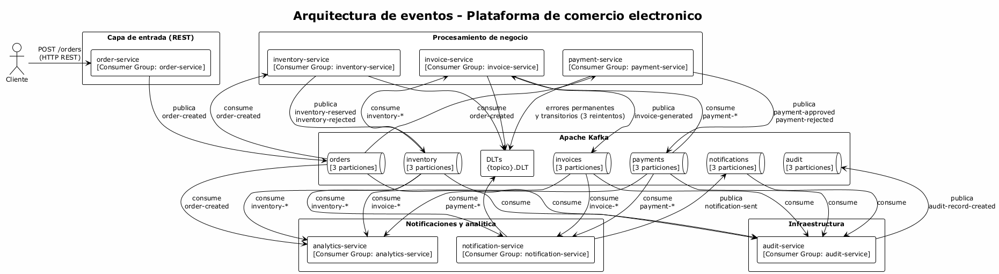
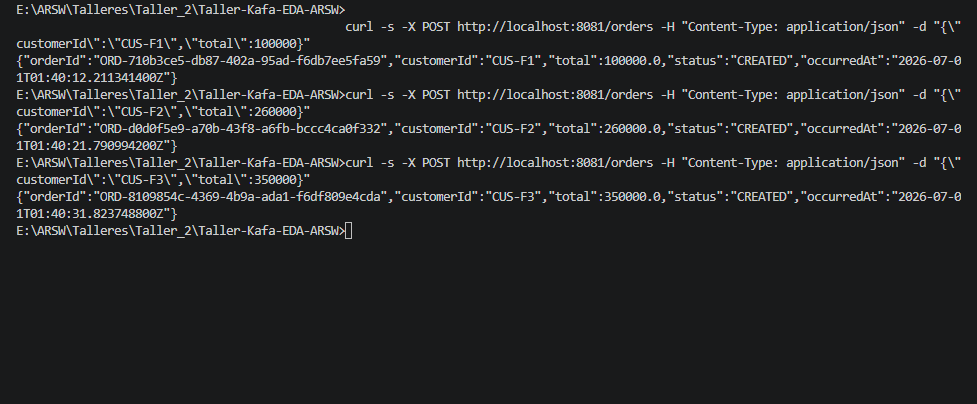
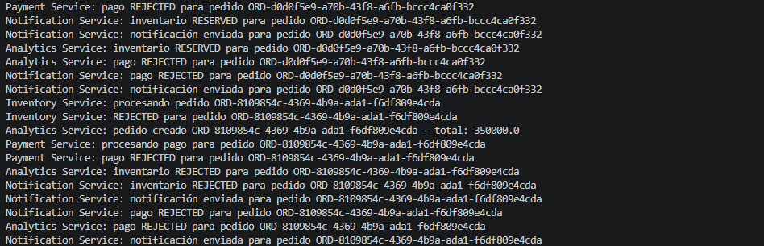
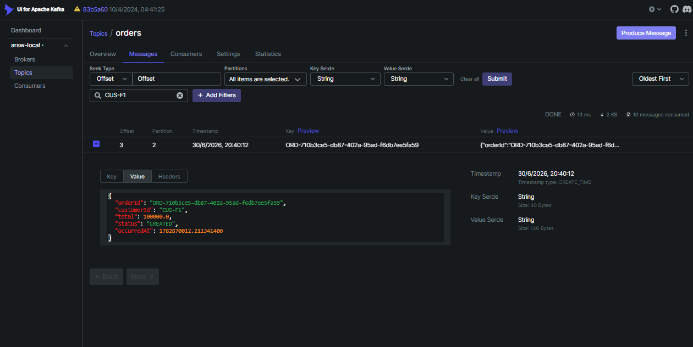
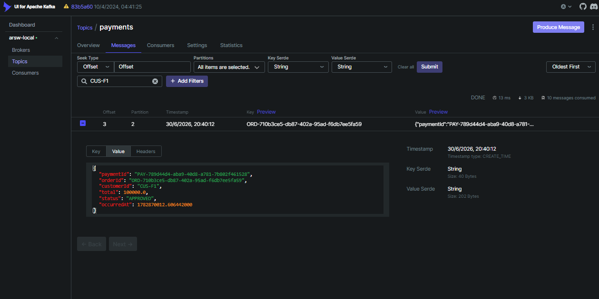
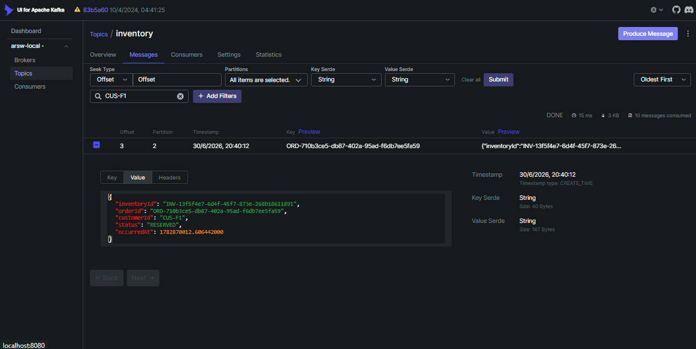
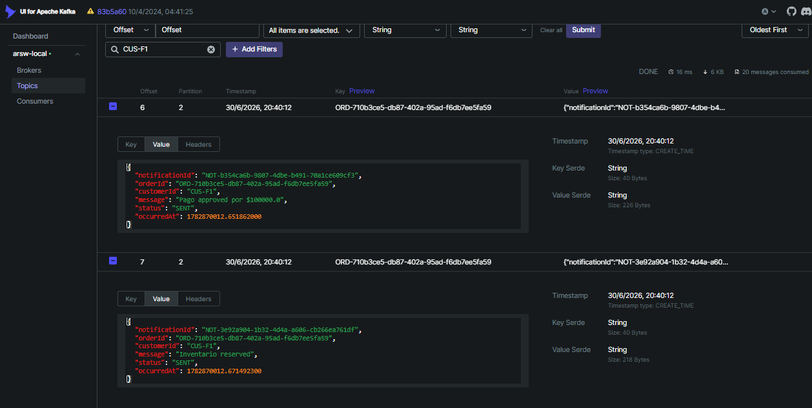
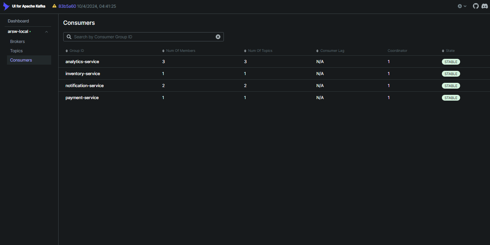

# Reto Final — Documento tecnico

Arquitectura basada en eventos para plataforma de comercio electronico con 7 servicios, 8 eventos y 6 topics en Kafka.

---

## Descripcion de la solucion

La plataforma se compone de 7 servicios independientes que se comunican exclusivamente a traves de eventos asincronos en Kafka. El flujo inicia cuando un cliente crea un pedido mediante REST en `order-service`, que publica un evento `order-created` al topic `orders`. A partir de ahi, `payment-service` e `inventory-service` consumen ese evento en paralelo, evaluan reglas de negocio (umbrales de monto) y publican sus resultados en `payments` e `inventory`. `invoice-service` reacciona solo si pago e inventario fueron exitosos y genera una factura en `invoices`. `notification-service` consolida todos los eventos relevantes y notifica al cliente. `analytics-service` consume todos los topics para construir metricas de negocio. `audit-service` registra cada evento como un log inmutable en `audit` para trazabilidad forense.

Cada servicio tiene su propio Consumer Group, lo que garantiza que todos reciban cada evento de forma independiente. Los topics estan particionados (3 particiones cada uno) y usan `orderId` como clave de particionamiento para preservar el orden de eventos por pedido. El topic `audit` usa `correlationId` como clave para correlacionar eventos entre servicios.

---

## Arquitectura propuesta

*Diagrama generado con PlantUML. Fuente: [diagrams/arquitectura_reto_final.puml](diagrams/arquitectura_reto_final.puml)*

---

## Tabla de servicios

| Servicio | Responsabilidad | Consumer Group | Topics que consume | Topics que produce |
|----------|----------------|----------------|-------------------|-------------------|
| order-service | Crear pedidos y publicar evento inicial | `order-service` | — | `orders` |
| payment-service | Validar pago segun umbral de monto | `payment-service` | `orders` | `payments` |
| inventory-service | Reservar inventario segun umbral de monto | `inventory-service` | `orders` | `inventory` |
| invoice-service | Generar factura si pago e inventario fueron exitosos | `invoice-service` | `payments`, `inventory` | `invoices` |
| notification-service | Enviar notificaciones al cliente | `notification-service` | `payments`, `inventory`, `invoices` | `notifications` |
| analytics-service | Construir metricas de negocio en tiempo real | `analytics-service` | `orders`, `payments`, `inventory`, `invoices` | — |
| audit-service | Registrar todos los eventos como log de auditoria | `audit-service` | `orders`, `payments`, `inventory`, `invoices`, `notifications` | `audit` |

---

## Tabla de eventos y topics

| Evento | Topic | Clave | Descripcion |
|--------|-------|-------|-------------|
| `order-created` | `orders` | `orderId` | Pedido creado por el cliente, contiene customerId, total y estado inicial CREATED |
| `payment-approved` | `payments` | `orderId` | Pago aprobado porque el monto no supera el umbral configurado (250000) |
| `payment-rejected` | `payments` | `orderId` | Pago rechazado porque el monto supera el umbral configurado |
| `inventory-reserved` | `inventory` | `orderId` | Inventario reservado exitosamente (monto dentro del limite de 300000) |
| `inventory-rejected` | `inventory` | `orderId` | Inventario rechazado por superar el limite permitido |
| `invoice-generated` | `invoices` | `orderId` | Factura generada solo si pago e inventario fueron exitosos |
| `notification-sent` | `notifications` | `orderId` | Notificacion enviada al cliente con el resultado del proceso |
| `audit-record-created` | `audit` | `correlationId` | Registro de auditoria con todos los eventos del flujo |

---

## Claves de particionamiento

| Topic | Clave | Justificacion |
|-------|-------|---------------|
| `orders` | `orderId` | Garantiza que todos los eventos del mismo pedido caigan en la misma particion, preservando el orden de procesamiento |
| `payments` | `orderId` | Misma clave que el evento original para que los consumidores puedan correlacionar facilmente |
| `inventory` | `orderId` | Idem, mantiene coherencia en el particionamiento transversal |
| `invoices` | `orderId` | La factura pertenece a un pedido especifico, debe estar en la misma particion que los eventos relacionados |
| `notifications` | `orderId` | Las notificaciones se agrupan por pedido para enviar resumen consolidado |
| `audit` | `correlationId` | Permite correlacionar todos los eventos de una misma transaccion a traves de servicios, incluso si involucran varios pedidos |

---

## Estrategia de errores

| Tipo de error | Accion | Reintentos | DLT |
|---------------|--------|-----------|-----|
| Transitorio (ej. BD caida, timeout de red) | Reintentar con backoff fijo de 2 segundos | 3 reintentos | `{topic}.DLT` |
| Permanente (ej. DeserializationException, IllegalArgumentException) | Enviar directamente al DLT sin reintentar | 0 reintentos | `{topic}.DLT` |
| Negocio (ej. pago rechazado, inventario agotado) | Publicar evento de error al topic correspondiente | No aplica reintento | No aplica DLT (es flujo esperado) |

---

## Riesgos identificados

1. **Perdida de orden de eventos**: Si un servicio publica eventos fuera de orden (ej. `inventory-reserved` antes de `order-created`), los consumidores pueden procesar en estado inconsistente. Mitigacion: usar `orderId` como clave para garantizar orden por particion y disenar consumidores tolerantes a eventos fuera de orden.

2. **Duplicacion de eventos**: Kafka puede entregar el mismo evento mas de una vez (al menos una vez). Sin idempotencia, un pago podria procesarse dos veces. Mitigacion: usar `eventId` como identificador unico en una tabla de eventos procesados, verificando antes de procesar.

3. **Consumidor caido sin deteccion**: Si un servicio falla y no se monitorea el lag, los eventos se acumulan y el problema solo se detecta cuando ya afecto al negocio. Mitigacion: monitorear el lag de cada Consumer Group con alertas automaticas cuando supere un umbral (ej. 10 mensajes).

---

## Justificacion de decisiones arquitectonicas

Se eligio Kafka como backbone de comunicacion asincrona porque el dominio de comercio electronico requiere desacoplamiento, multiples consumidores por evento, capacidad de reprocesamiento y registro inmutable para auditoria. La comunicacion REST se reserva solo para la entrada del sistema (creacion de pedidos) donde el cliente necesita confirmacion inmediata.

Los topics se organizaron por dominio (`orders`, `payments`, `inventory`, etc.) en lugar de un unico topic `events` porque: (a) cada servicio solo consume los topics que le interesan, (b) se puede configurar retencion diferente por tipo de evento, (c) es mas facil monitorear el lag por servicio y (d) un fallo en un topic no afecta a los demas.

Cada servicio tiene su propio Consumer Group para que todos reciban cada evento de forma independiente. Si `payment-service` e `inventory-service` compartieran grupo, solo uno procesaria cada evento, rompiendo el flujo.

El particionamiento con `orderId` garantiza orden dentro de cada pedido. Las 3 particiones por topic permiten escalar horizontalmente hasta 3 consumidores por grupo. En produccion se recomienda aumentar segun el volumen esperado.

La estrategia de errores con DLT permite recuperar eventos fallidos sin perder datos. Los errores transitorios se reintentan 3 veces con backoff fijo de 2 segundos; los permanentes van directamente al DLT para revision manual. Los errores de negocio (rechazos de pago/inventario) no van al DLT porque son parte del flujo esperado.

---

## Consideraciones sobre consistencia eventual

El sistema es eventualmente consistente: cuando un cliente crea un pedido via REST, recibe confirmacion inmediata con estado `CREATED`, pero el estado final (pago aprobado/rechazado, inventario reservado/rechazado) solo se conoce despues de que los servicios procesan los eventos de forma asincrona. Esto significa que:

- El cliente puede ver su pedido como "CREATED" antes de saber si el pago fue aprobado.
- Si el pago falla, el cliente recibe una notificacion posterior, no en el momento de la creacion.
- Los servicios de analitica y auditoria pueden tener un rezago (lag) de segundos o minutos respecto al estado real.
- Si un consumidor falla temporalmente, los eventos se acumulan en Kafka y se procesan cuando se recupera, manteniendo la consistencia final.

Para mitigar los efectos de la consistencia eventual en la experiencia de usuario, el sistema expone un endpoint REST en `order-service` para consultar el estado consolidado del pedido en tiempo real, leyendo de la base de datos local que se actualiza con cada evento procesado. Esto permite al cliente obtener el estado final sin depender del flujo asincrono.

---

## Evidencia de funcionamiento (Prueba del flujo completo)

A continuacion se presentan las capturas de pantalla que evidencian la ejecucion del flujo completo de la arquitectura propuesta, siguiendo el paso a paso detallado.

---

### Evidencia 1 — Creacion de pedidos via curl

**Descripcion:** Muestra la ejecucion de los 3 comandos curl contra el endpoint `POST /orders` del `order-service`. Cada pedido devuelve `201 Created` con su `orderId` UUID y estado `"CREATED"`. Los pedidos creados son CUS-F1 (100,000), CUS-F2 (260,000) y CUS-F3 (350,000).

---

### Evidencia 2 — Logs de la aplicacion Spring Boot

**Descripcion:** Muestra los logs generados por los servicios al procesar los 3 pedidos: `payment-service` aprueba o rechaza segun umbral de 250,000; `inventory-service` reserva o rechaza segun umbral de 300,000; `notification-service` genera 2 notificaciones por pedido; `analytics-service` registra cada evento.

---

### Evidencia 3 — Seguimiento en topic orders por orderId

**Descripcion:** Muestra el mensaje en el topic `orders` filtrado por el orderId del pedido. Se visualiza el evento `order-created` con los datos completos del pedido, su particion asignada y offset correspondiente.

---

### Evidencia 4 — Seguimiento en topic payments por orderId

**Descripcion:** Muestra el mensaje en el topic `payments` para el mismo orderId. Se visualiza el evento `payment-processed` con el resultado (`APPROVED` o `REJECTED`) segun la regla de negocio aplicada por `payment-service`.

---

### Evidencia 5 — Seguimiento en topic inventory por orderId

**Descripcion:** Muestra el mensaje en el topic `inventory` para el mismo orderId. Se visualiza el evento `inventory-processed` con el resultado (`RESERVED` o `REJECTED`) segun la regla de negocio aplicada por `inventory-service`.

---

### Evidencia 6 — Seguimiento en topic notifications por orderId

**Descripcion:** Muestra los mensajes en el topic `notifications` para el mismo orderId. Se visualizan 2 eventos `notification-sent` generados por `notification-service`: uno con el resultado del pago y otro con el resultado del inventario.

---

### Evidencia 7 — Consumer Groups en Kafka UI

**Descripcion:** Muestra los 4 Consumer Groups activos (`arsw-payment-service`, `arsw-inventory-service`, `arsw-notification-service`, `arsw-analytics-service`) con lag = 0 en todas las particiones, indicando que todos los eventos fueron procesados sin atrasos.
